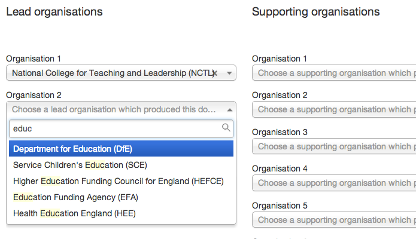

## Add associations (tagging and metadata)

You can tag your document to organisations, topics, policies, ministers and international locations (depending on content format).

Associations are found below the document body text, just underneath the upload images section. 

* Click within the association field drop-down menu appears showing all the possible values you can enter.

	
* Start typing and it will narrow down your available options.

* Once you've selected an option it appears in a rectangle.

* To remove it, click the ‘x’.

### Mandatory associations

You must:

* tag to a lead organisation (this will default to your own organisation) 
* add other lead and supporting organisations (check)
* tag to an alternative format provider
* tag all content to a policy, with some exceptions (see below)
* tag to a speaker for a speech (see below)

### Add more associations

Use associations purposefully but sparingly. On policies or topics, for example, 1 is best and any more than 3 is too many.

#### Associations for publications and consultations

Tag publications and consultations to: 

* policy/policies, except transparency data, fatality notices and FOI releases (you should know your sponsoring department's policies and be aware which content relates to which policy)
* topic/topics only if you cannot identify a policy - this acts as a back-up (tagging to topics is coming soon)
* document series to help users to find content (you may wish to [create a document series](http://alphagov.github.io/inside-government-admin-guide/organisations-groups/document-series.html) for your content and related documents, but be aware that document series form an information architcture for your organisation, so they can't be created in an ad hoc way)
* ministers only in cases of direct involvement (eg writing the foreword)
* topical events only if relevant.
* worldwide locations and priorities only if you are working for the Foreign & Commonwealth Office and know how to use these tags

#### Associations for announcements

Speeches are tagged to their speakers in all cases, so ministers do not appear in the associations list. Tag announcements to:

* policy/policies (you should know your sponsoring department's policies and be aware which content relates to which policy
* topic/topics only if you cannot identify a policy - this acts as a back-up (tagging to topics is coming soon)
* document series only if highly relevant - document series are more suited to publications (see above)
* ministers or other people for news only in cases of direct involvement (eg a minister's visit)
* topical events only if relevant
* worldwide locations and priorities only if you are working for the Foreign & Commonwealth Office and know how to use these tags

