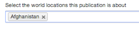

## Add associations (tagging and metadata)

You can tag your document to organisations, topics, policies, ministers and international locations (depending on content format).

Associations are found below the document body text, just underneath the upload images section. 

* Click within the association field drop-down menu appears showing all the possible values you can enter.

	
* Start typing and it will narrow down your available options.

* Once you've selected an option it appears in a rectangle.

* To remove it, click the ‘x’.

### Mandatory associations

Publisher will require you to:

* tag to a lead organisation (this will default to your own organisation) 
* tag to an alternative format provider
* tag to a speaker for a speech (see below)

You must also:

* add other lead and supporting organisations if they share responsibility for the document or policy etc
* where possible tag content to a policy - all GOV.UK content with some exceptions should be relevant to what the currently elected government is doing 

### Tagging to a policy 

Tagging to a policy or policies automatically tags the content to one or more topics (you will see these populating the 'topics' field as soon as you select a policy). It is useful because:

* end users can filter on policy or topic to view content
* end users can view or subscribe to the tagged content via the 'latest' activity tab on each policy
* GDS can alert info4local users to content tagged to policies relevant to local government

Use associations purposefully but sparingly. On policies, 1 is best and any more than 3 is probably too many.

#### Associations for publications and consultations

Tag publications and consultations to: 

* policy/policies, except transparency data, some statistics, fatality notices and FOI releases (you should know your sponsoring department's policies and be aware which content relates to which policy)
* topic/topics only if you cannot identify a policy - this acts as a back-up
* document series to help users to find content (you may wish to [create a document series](http://alphagov.github.io/inside-government-admin-guide/organisations-groups/document-series.html) for your content and related documents, but be aware that document series form an information architcture for your organisation, so they can't be created in an ad hoc way)
* ministers only in cases of direct involvement (eg writing the foreword)
* topical events only if relevant.
* worldwide locations and priorities only if you are working for the Foreign & Commonwealth Office and know how to use these tags

#### Associations for announcements

Speeches are tagged to their speakers in all cases, so ministers do not appear in the associations list. Tag announcements to:

* policy/policies (you should know your sponsoring department's policies and be aware which content relates to which policy)
* topic/topics only if you cannot identify a policy - this acts as a back-up
* document series only if highly relevant - document series are more suited to publications (see above)
* ministers or other people for news only in cases of direct involvement (eg a minister's visit)
* topical events only if relevant
* worldwide locations and priorities only if you are working for the Foreign & Commonwealth Office and know how to use these tags

