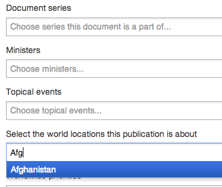

## Add associations

1. You can associate your document with  organisations, topics, policies, ministers and international locations (depending on content format).

	Use associations sparingly. On topics, for example, 1 topic is best. Any more than 3 is too many.
	
	
	
	Click on any of these fields.
	
	A drop down menu appears showing all the possible values you can enter.

	Start typing and it will narrow down your available options.
	
	
	
	International associations are optional and are mainly there for use by FCO, DFID and MOD.
	
2. Pick any option and it appears in a rectangle like this.

	
	
	To remove it, click ‘x’.
	
3. Sometimes you won’t find any matches. In this case, try searching for other suitable terms.

	

4. If the missing data is a group, role or person you can add it yourself.

	Please check with GDS before creating any ministerial roles or people.
	
	
	
5. Use associations sparingly. On topics, for example, 1 topic is best. Any more than 3 is too many.

	