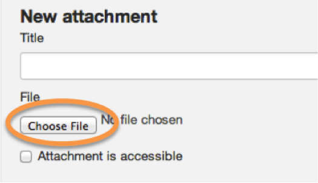
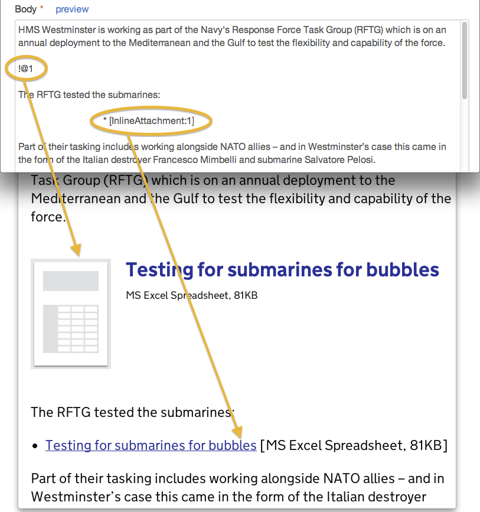
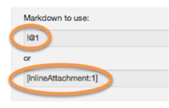
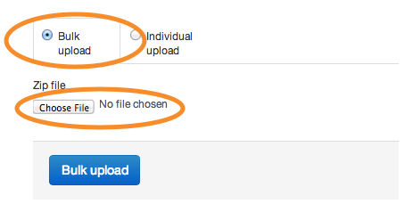
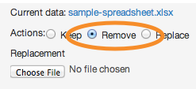

## Add attachments

1. You can add attachments individually or in bulk.

	Upload a single attachment by clicking the 'choose file' button. 
	
	
	
	The following formats are accepted: pdf, csv, rtf, png, jpg, doc, docx, xls, xlsx, ppt, pptx, zip, rdf, txt, xml, ods, odt, odp.
	
2. If your attachment is fully accessible then tick this box.

	
	
	In the run up to your site going live, this checkbox will default to unchecked. 
	
	If you're uncertain if a document is fully accessible, leave it unchecked and we'll tackle this post launch.
	
3. Once your document is saved, you can position attachments where you like. 

	
	
	Either either of these markdown commands to place the attachment at the right place.
	
	Use !@n for a big publications box.
	
	Use [InlineAttachment:n] for a text link.
	
	The number corresponds to the order in which you've uploaded attachments.
	
4. Save the document and your attachments will be automatically uploaded to our server.

	
	
5. You can also upload files in bulk.

	Create a zip file containing all the documents you want to upload.
	
	Click the 'choose file' button and upload the zip file as normal.
	
	

	When you see a "Bulk upload successful" message you can add titles and other metadata to the files.

	The bulk uploader can also be used to quickly overwrite previous versions of files. Just make sure that the new file has the same filename as the old one, and the uploader will do the rest.
	
6. It's easy to replace any individual file with a new version.

	Select 'Replace' next to the attachment you'd like to swap out.
	
	
	
	Upload the new file and it will overwrite the old at the same url location.
	
	The markdown for this file stays the same (ie !@n) so there's no need to change this.

