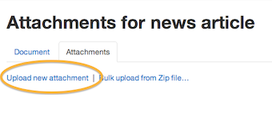
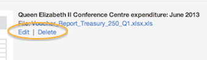

# Add attachments

You can add attachments individually or you can bulk-upload a zip file containing multiple attachments. These formats are accepted: pdf, csv, rtf, png, jpg, doc, docx, xls, xlsx, ppt, pptx, zip, rdf, txt, xml, ods, odt, odp.

Attachments can't be added until after the document has been saved.

## Upload attachment(s) individually

* On a saved document, select 'Edit' and then go to the attachments tab.

* Select 'Upload an attachment' 
* Fill in the title: use the title of the document as it appears on the cover. 
* Fill in the rest of the metadata as required. These fields are searchable and may help your users to find the document (eg reference numbers for FOI requests).

* Upload the first attachment by clicking the 'Choose file' button.

* If your attachment is fully accessible then tick the box.
   * The [style guide section 13](https://www.gov.uk/designprinciples/accessiblepdfs) explains how to check if a document is accessible. 
   * If the attachment is not accessible you leave the box unticked - users are then given an email contact for requesting an alternative format.
* Continue to upload more attachments by repeating the process.

## Position the attachments

For publications and consultations, the attachments will be added to the page in the order they were uploaded. 

They can be repositioned right away or later on.

* Click 'Edit' and go to the attachments tab (if you are not in 'Edit' the attachments can't be re-ordered).
* Use your cursor (which should be a cross) to drag and reposition your attachments.
* Click 'Save attachment order' at the bottom of the tab: this completes your re-ordering and you can exit the document.

For news, detailed guides and HTML publications, the attachments are all given 2 alternative Markdown codes so that they can be positioned within the body text. You can use either of these codes to position the attachment where you like in your document.

The first attachment is number 1, the other attachments are numbered according to the order in which they’re uploaded. 

* In the text, type \[InlineAttachment:1\] for a text link.
* OR type !@1 for a tinted publication box (leave a line space above).

	

* [InlineAttachment:n] pulls in the attachment title as hypertext, adding the file type and size in brackets. You can also list these with bullet points (useful for several related attachments).
* !@n creates a grey tint box with the front cover of the attached document, and adds the file type and size under the title.

It’s easy to re-order or reposition the attachments by where you choose to place the Markdown code on the page. The number given to an attachment will not change, even if attachments are removed later.

## Bulk upload

You can also upload files in bulk.

* Create a zip file containing all the documents you want to upload.
* On a saved document, select 'Edit'

* Click the 'choose file' button and upload the zip file. You will get a listing of all the uploaded files, awaiting their titles and metadata.

* Add titles and other metadata to the files.

The bulk uploader can also be used to quickly overwrite previous versions of files. Just make sure that the new file has the same filename as the old one, and the uploader will do the rest.

## Replace, edit or remove attachments

* To replace an attachment, in edit mode, click on the attachments tab.
* Select 'Edit' next to the attachment you'd like to swap out.

* Upload a new file and it will overwrite the old at the same url location. The markdown for this file stays the same (ie !@n) so there's no need to change this.
* You could also edit the title or other metadata for an existing attachment.
* To delete a file, click 'Delete', you will be asked to confirm your action and then the file will be deleted (no need for further saving).

