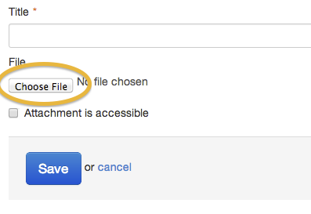
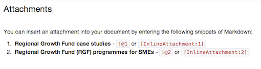

## Adding attachments

You can add attachments individually or you can bulk-upload a zip file containing multiple attachments. These formats are accepted: pdf, csv, rtf, png, jpg, doc, docx, xls, xlsx, ppt, pptx, zip, rdf, txt, xml, ods, odt, odp.

### Upload attachments individually

* Select and upload a single attachment by clicking the 'Choose file' button.

	

* If your attachment is fully accessible then tick the box.
  * The [style guide 13](https://www.gov.uk/designprinciples/accessiblepdfs) explains how to check if a document is accessible. If the box is left unchecked, users are prompted to request a different format from an email address supplied by the page's owning organisation.
* Each attachment needs a title: use the title of the document as it appears on the cover. If you leave a title box blank, the upload wll fail. 

### Save the page

Once your document is saved, the attachments will be uploaded to the server. 

* For publications and consultations, the attachments will be added to the page in the order they were uploaded - they can't be re-ordered later. 
* For news, detailed guides and HTML publications, the attachments are all given 2 alternative Markdown codes and you can use either of these codes to position the attachment where you like in your document.

IMAGE 2

### Position the first attachment 

* Use \[InlineAttachment:1\] for a text link.
* Use !@1 for a tinted publications box.

	
	
The first attachment is number 1, the other attachments are numbered according to the order in which they’re uploaded. 

* [InlineAttachment:n] pulls in the attachment title as hypertext, adding the file type and size in brackets. You can also list these with bullet points (useful for several related attachments).
* !@n creates a grey tint box with the front cover of the attached document, and adds the file type and size under the title.

It’s easy to re-order or reposition the attachments by where you choose to place the Markdown code on the page. The number given to an attachment will not change.

5. You can also upload files in bulk.

	Create a zip file containing all the documents you want to upload.

	Click the 'choose file' button and upload the zip file as normal.

	

	When you see a "Bulk upload successful" message you can add titles and other metadata to the files.

	The bulk uploader can also be used to quickly overwrite previous versions of files. Just make sure that the new file has the same filename as the old one, and the uploader will do the rest.

6. It's easy to replace any individual file with a new version.

	Select 'Replace' next to the attachment you'd like to swap out.

	

	Upload the new file and it will overwrite the old at the same url location.

	The markdown for this file stays the same (ie !@n) so there's no need to change this.

