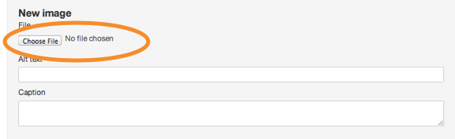
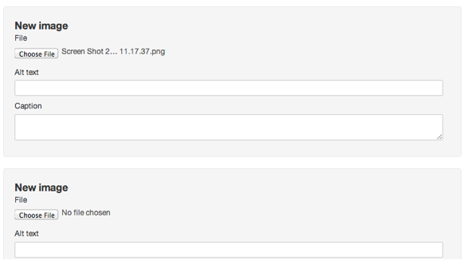
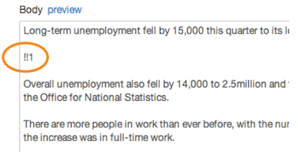

## Add images

<object width="420" height="315"><param name="movie" value="http://www.youtube-nocookie.com/v/aBVD1JmKgIw?version=3&amp;hl=en_GB&amp;rel=0"></param><param name="allowFullScreen" value="true"></param><param name="allowscriptaccess" value="always"></param><embed src="http://www.youtube-nocookie.com/v/aBVD1JmKgIw?version=3&amp;hl=en_GB&amp;rel=0" type="application/x-shockwave-flash" width="420" height="315" allowscriptaccess="always" allowfullscreen="true"></embed></object>

1. Images can be added to news articles, speeches, case studies, detailed guides and supporting detail pages on policies.

	Upload an image by clicking the 'choose file' button. All images should be 960 x 640 px.
	
	Always add an alt tag. If the image isn't important to explaining the content, you can add an asterisk instead.
	
	

2. When you've picked an image to use, another ‘new image’ box automatically appears so you can pick more.

	
	
3. You can position images where you like within a document.

	Just type !! and the image number where you’d like it to appear (the first image you add is 1, second is 2 and so on).
	
	The first image on a news or speech is automatically placed on the left hand side of the page. Any subsequent images can be positioned using !!2, !!3 etc.

	
	
4. Save the document and your images will be automatically uploaded to our server.

	

	
