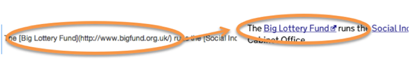
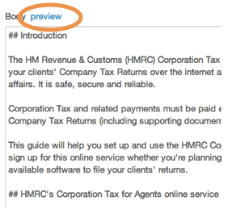
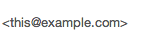

## Add links

### Add external links

You can add links anywhere in body text, but not in titles, summaries or sub-headers.

Put the text you want to click in \[square brackets\] and the external URL in curved brackets, with no space between them.

Click the preview toggle to check your URLs are valid.

An external link icon appears automatically on any non GOV.UK web addresses.

### Add internal links to GOV.UK pages

Put the text you want to click in \[square brackets\] and the internal URL in curved brackets, with no space between them.

Use the Publisher URL (like https://whitehall-admin.production.alphagov.co.uk/government/admin/publications/221540) when linking to any document made by the ‘create new document’ button (publications, consultations, speeches etc). 

You should delete the first part of the URL and use the relative path: /government/admin/publications/221540.

#### Exception to this rule (important)

Use the live URL (like https://www.gov.uk/government/organisations/ministry-of-defence/series/firing-notice) when linking to any page that is not a document (organisation pages, people, groups, document series, search pages etc).

Make sure you go to the [public version of GOV.UK](https://gov.uk/government) to get the correct URL. Don’t use any URLs accessed via Publisher. You cannot use the relative path, you will need the full URL.

###Email links

Use 'less than' and 'greater than' arrows around email addresses to make them a link, eg:

### Add anchor links

Publisher creates anchor links automatically, based on the H2s that you put into your document. If you wish to link to these bookmarked sections, you just need to add a hashtag sign \# and the H2 slug to the end of the live URL like this: https://www.gov.uk/maritime-security#ship-security-plans.

Anchor links for corporate pages include:

* https://www.gov.uk/government/organisations/ministry-of-defence#corporate-info
* https://www.gov.uk/government/organisations/ministry-of-defence#high-profile-units
* https://www.gov.uk/government/organisations/ministry-of-defence#management
* https://www.gov.uk/government/organisations/ministry-of-defence#ministers
* https://www.gov.uk/government/organisations/ministry-of-defence#org-contacts
* https://www.gov.uk/government/organisations/ministry-of-defence#people
* https://www.gov.uk/government/organisations/ministry-of-defence#policies
* https://www.gov.uk/government/organisations/ministry-of-defence#topics
* https://www.gov.uk/government/organisations/ministry-of-defence#what-we-do

### Style for links

You should write clear link text to tell the user about the page they will land on if they click. It should be part of the running text, not single words and never 'click here' or similar. Make sure that there are not too many links in your body text and never more than 1 per sentence.

Don't use hover text on links. 

[< Back to contents](http://alphagov.github.io/inside-government-admin-guide/)

