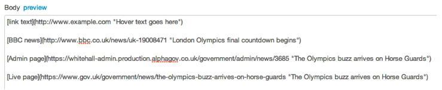
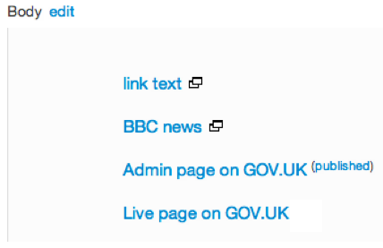

## Add links

1. Links can be added to any document format.

	Put the text you want to click in [square brackets], the web address in (curved brackets together with any hover text in "quote marks").

	

2. Click 'preview' to check your URLs are valid.

	An external link icon appears automatically on any non GOV.UK web addresses.

	
	
### How to link to pages on GOV.UK

1. Use the live url when linking to…

	* an anchor within a page
	
	* any page accessed via the top navigation
	
	Make sure you go to the public version of GOV.UK to get the correct url. Don’t use any urls accessed via the admin site.

2. Use the admin url when linking to...

	* any document made by the ‘create new document’ button