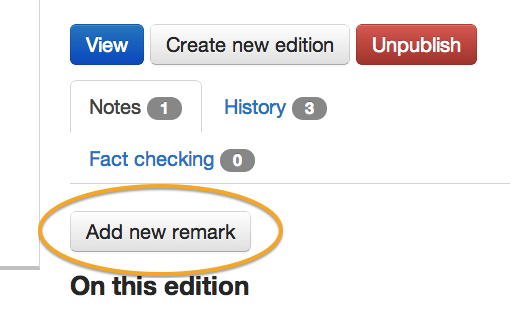

Please note this manual is a draft version and will be revised shortly.

#Add remarks

You can leave comments on pages in Publisher that will show in the item's history, eg to leave information for future editors about what's been done to the content.

Click 'Add new remark' to add a comment.

[< Back to contents](http://alphagov.github.io/inside-government-admin-guide/)
