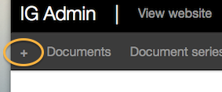

## Create a new document

Click the ‘Create new document’ button.

Or use the plus sign in the top navigation.

A drop-down menu appears. Pick the [document type](http://alphagov.github.io/inside-government-admin-guide/creating-documents/document-types.html) you want.

A new document appears.

* Enter text into the title, summary and body fields as needed.
* When you've entered some text, click 'preview' to see what your page will look like.
* Use the simple commands on the right of the page - called [Markdown](/inside-government-admin-guide/creating-documents/markdown.html) - to add headings, links, quotes and more.
* Assign a document type (below the body with a red asterisk for compulsory field).
* Assign a lead department (this will be defaulted to your own department).
* Assign an email address for ordering this publication in an alternative format - choose from drop-down list and consult with your transition manager or department lead editor if you are not sure which one is correct.

Make sure you save your work: 'Save' will return you to the document hub; 'Save and continue editing' will take you back to the document to add images or attachments, make associations or re-edit content.

For most publications and speeches, [attachments](http://alphagov.github.io/inside-government-admin-guide/creating-documents/add-attachments.html) and [associations](http://alphagov.github.io/inside-government-admin-guide/creating-documents/add-associations.html) are mandatory so you will need to continue editing.

