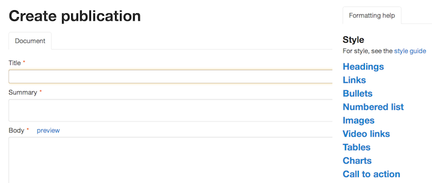

## Creating a new document

Click the ‘Create new document’ button.

	
	
Or use the plus sign in the top navigation.

	
	

A drop down menu appears. Pick the format you want.

	
	
A new document appears.

* Enter text into the title, summary and body fields as needed.
* When you've entered some text, click 'preview' to see what your page will look like.
* Use the simple commands on the right of the page - called [Markdown](/inside-government-admin-guide/creating-documents/markdown.html) - to add headings, bold text, quotes and more.

	
	
Make sure you save your work: 'Save' will return you to the document hub; 'Save and continue editing' will take you back to the document to add images or attachments, make associations or re-edit content.

	

