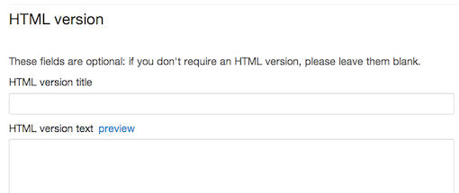

## Create an HTML publication

An HTML publication cannot be created directly from the 'Create a document' button. It is an attachment on a publication, just as you would attach a PDF or a Word document. 

So first you create a publication page to hold your HTML document, then you scroll down and add the HTML document text into the field labelled HTML version.

[See guidance on creating a publication page](http://alphagov.github.io/inside-government-admin-guide/creating-documents/create-a-new-doc.html).

When you have created the publication you can add the HTML document to it.

* Scroll down to below the page body text to find the box entitled 'HTML version'.

* Give the HTML publication a title and summary, just as you would when attaching a file.
* In the body text, use Markdown to format the text just as in the rest of Publisher.
* Give the publication H2s using the \#\# Markdown - these are listed as bookmarks at the top so users can navigate the section.
* Attach files to your page and position them in your publication using the usual Markdown.

See an [example of an HTML publication.](https://www.gov.uk/government/publications/immigration-statistics-january-to-march-2013)

