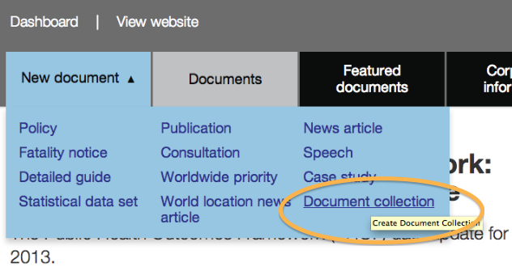
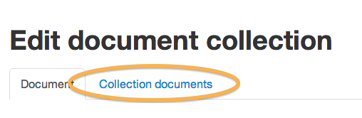
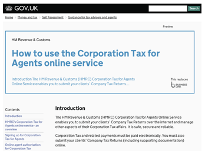

Please note this manual is a draft version and will be revised shortly.

# Create and populate collections 

Collections are for thematically linked documents, such as all the forms and guidance relating to a particular product type or used by people carrying out a particular task. As a rough indicator, a collection would be too big if it contained all the guidance for a profession or all the content for a whole subject. For these, GOV.UK offers 'categories' and 'topics'. When deciding what to put into a collection, think of meeting a user need in an efficient and convenient way. A collection lists the documents it contains and they can be divided into sub-sections called groups. Collections appear in search results and are weighted to appear higher than a single document.

### Create a collection

It is best if the documents you want to put into the collection are already created and you have the slugs to hand (the end part of their GOV.UK URL - eg 'public-health-outcomes-framework').

* From the main navigation, click on 'New document' and select 'Document collection'.
* Write the title and summary in a way that explains the reason and purpose for the collection to a user who sees it in search results, following the [style for titles and summaries](https://www.gov.uk/designprinciples/detailedguides).
* Write a sentence or 2 in the body section - this introduces the list.
* Complete the tagging as for any other document. 
* Save your work; the 'Collection documents' tab will appear.

### Populate the collection

* Click on the 'Collection documents' tab and start adding documents to your collection - you can do this most easily by entering the slug in the search box, but search terms work too.

### Allocate documents to groups

You can create the groups and allocate the documents to them using the tickboxes. Or you can create the groups and then add documents directly into the right ones.

* Create each group using 'Add a new group' button - note that the 'body' text is not mandatory.
* Switch existing documents into your new group by selecting them and then using the 'Move' blue button.
* Add documents
* Upload directly into the group

Your page opens in a new window or tab. It is an exact preview of how it will appear on the site. 

### Preview of organisation home page

Sometimes before your organisation goes live you want to see what it will look like. In consultation with your transition manager, you can use the Preview site to do this. (It is the separate site for which you will have a separate login, at [https://whitehall-admin.preview.alphagov.co.uk/](https://whitehall-admin.preview.alphagov.co.uk/).)

If your pages are complete on the Production site, and the status of your organisation is set to 'Coming soon' then you can wait for Production content to be copied to Preview, and then within Preview you can put your home page live. It will be visible on the web but is password protected by the betademo password.

Make sure you don't accidentally put your home page live on the Production site before your launch date. Check the URL before changing your status to live. 

### Preview of documents for stakeholders or policy teams

You can use [fact check](http://alphagov.github.io/inside-government-admin-guide/workflow-content/fact-checking.html) to send preview documents (policies, publications, consultations etc) to people without Publisher accounts. Fact check does not currently work for organisation home pages or corporate pages.

### Submit a document for publication

Click the green 'Submit' button. Your document should be picked up by [second pair of eyes](http://alphagov.github.io/inside-government-admin-guide/workflow-content/second-pair-of-eyes.html) so it can be checked and published.

If no one is available and you need to publish your page quickly, you can [force publish](http://alphagov.github.io/inside-government-admin-guide/workflow-content/second-pair-of-eyes.html); ensure that the page is given a 'looks good' approval as soon as possible after this.

[< Back to contents](http://alphagov.github.io/inside-government-admin-guide/)

