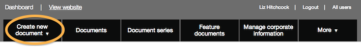
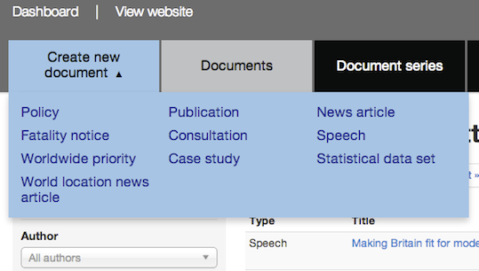

## Creating a new document

1. Click the ‘Create new document’ button.

	
	

2. A drop down menu appears. Pick the format you want.

	
	
3. A new document appears.

	Enter text into the title, summary and body fields as needed.
	
	When you've entered some text, click 'preview' to see what your page will look like.
	
	Use the simple commands on the right of the page - called [Markdown](/inside-government-admin-guide/first-steps/markdown.html) - to add headings, bold text, quotes and more.

	
	
4. Make sure you save your work!

	

