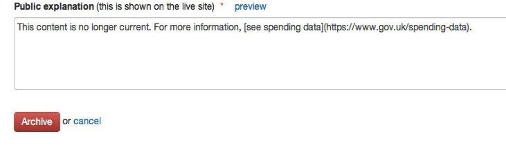
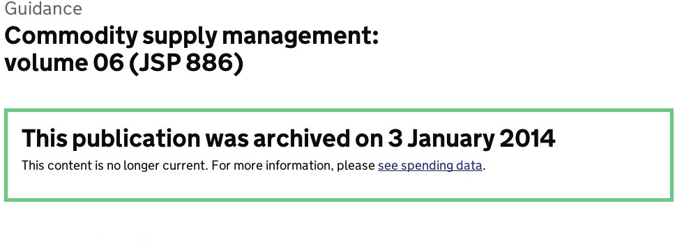
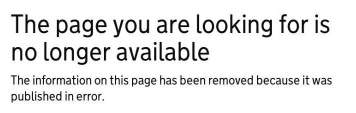

Removing GOV.UK content after it’s been published is a poor experience for users so please only do this when necessary. People with 'Managing editor' permissions within departments and agencies can unpublish and archive documents in the departments and policy section of GOV.UK. Each organisation is entitled to have 2 people with managing editor permissions.

Get in touch with GDS using the [support form](https://gov.uk/support/internal) if your organisation doesn't have anyone with managing editor permissions.

#How to archive or unpublish

If you have managing editor permissions, Click on the red ‘archive or unpublish’ button in the live version of the document:

**Always give a full redirect URL you want to send users to if one is available.**

##Archive

You can include Markdown in the public explanation box, eg a link. 

It’ll look like this on the live site:

The item will still appear in search results.

##Unpublish (published in error)

Add a redirect URL if you have somewhere to redirect to (full GOV.UK URLs only), and tick the ‘Redirect to URL automatically’ box. 
You can include Markdown in the public explanation box. 

It’ll look something like this on the live site:

##Unpublish (consolidated into another GOV.UK page)

Paste in the full GOV.UK URL you want users to be sent to.

**When you unpublish or archive, the content item is reverted to draft. Please leave this in draft - deleting it can cause data problems.**

#Changing URLs

URLs are automatically created from the page title when you publish the page and can only be changed by a developer. This will only be done in exceptional circumstances.

#Requests for short URLs

Decisions on creating short URLs are made by GDS based on user need. It is useful if you read [our blog post on friendly URLs](http://inside-inside-gov.tumblr.com/post/47775179301/short-urls-for-organisations-profile-pages) before getting in touch.

[< Back to contents](http://alphagov.github.io/inside-government-admin-guide/)
