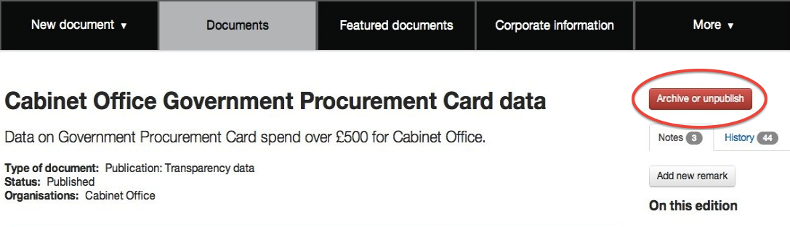
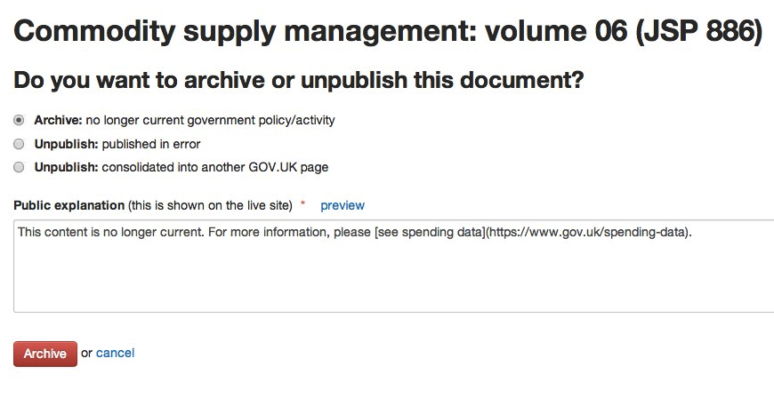
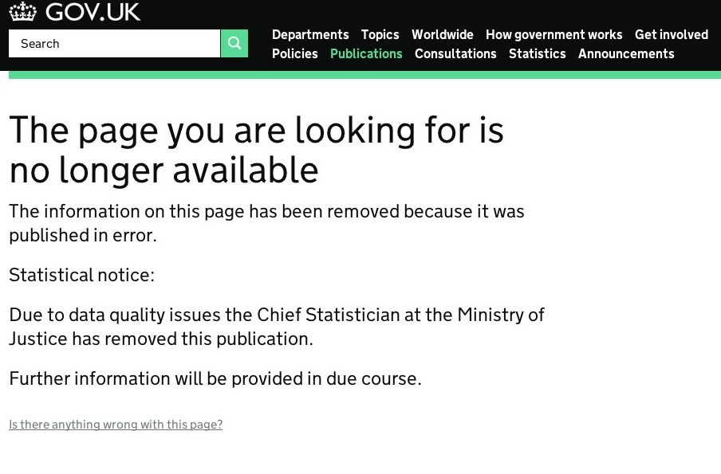

#Archive or unpublish content

Removing GOV.UK content after it’s been published is a poor experience for users so please only do this when necessary. People with 'managing editor' permissions within departments and agencies can unpublish and archive documents in the departments and policy section of GOV.UK. Each organisation is entitled to have 2 people with managing editor permissions.

Get in touch with GDS using the [support form](https://gov.uk/support/internal) if your organisation doesn't have anyone with managing editor permissions.

#How to archive or unpublish

If you have managing editor permissions, click on the red ‘Archive or unpublish’ button in the live version of the document:

**Always give a URL you want to send users to if there is one.**

##Archive

Archiving content means it's still available at the same URL. You won't be able to create any new versions of the content but you can edit the explanatory text that appears on the archived page.

Select the archive option for content that is no longer relevant. You can include Markdown in the public explanation box, eg a link. 

It’ll look like this on the live site:

The item will appear in GOV.UK internal search and external search engine results but won't appear in document filter pages (like the publications page).

The archived document will also no longer be listed in any of the following:

- document collections it is part of
- related document sections on the public site eg an organisation's 'Documents' section
- the lists of policies, announcements, etc, on a person’s profile page
- atom feeds
- govdelivery notifications

If the archived document is featured on an organisation’s homepage, it will continue to be listed there until it's un-featured.

**Links from within the body copy won't be automatically removed from other pages.**

##Unpublish (published in error)

Add a redirect URL if you have somewhere to redirect to (full GOV.UK URLs only), and tick the ‘Redirect to URL automatically’ box. 
You can include Markdown in the public explanation box. 

It’ll look like this on the live site:

##Unpublish (consolidated into another GOV.UK page)

Paste in the full GOV.UK URL you want users to be sent to.

#Changing URLs

URLs are automatically created from the page title when you publish the page and can only be changed by a developer. This will only be done in exceptional circumstances.

#Requests for short URLs

Decisions on creating short URLs are made by GDS based on user need. It is useful if you read [our blog post on friendly URLs](http://inside-inside-gov.tumblr.com/post/47775179301/short-urls-for-organisations-profile-pages) before getting in touch.

[< Back to contents](http://alphagov.github.io/inside-government-admin-guide/)
