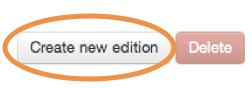

## Editing a doc

1. Click on a document title to view it.

	
	
2. Click one of these buttons on the right hand side of the document.

	
	
	OR
	
	
	
3. Your document appears and you can now edit it.

	
	
4. When you change the content within a document, make sure you describe what you’ve done in the ‘Change note’ field.

	Enter something short but useful, beginning with a past tense verb.

	
	
5. If the change is minor (eg fixing a typo or a style correction) then click the ‘Minor change’ box.

	
	
6. Change notes appear on the live site and you can see them by clicking the date of the article. They are also included in emails to subscribers and on content feeds.

	
	
	Any major changes will appear in the latest box on your homepage and in email alerts and feeds. Minor changes won’t appear in any of these.
	
7. It’s also a good idea to add a remark so other editors can see what you’ve changed.

	Click the ‘Add new remark’ button.

	
	
8. Enter a comment describing what you’ve changed and click on ‘Submit remark’ when you’re done.

		
	
9. Now fellow editors can see what you’ve done. This info isn’t published to the live site.

		
	

