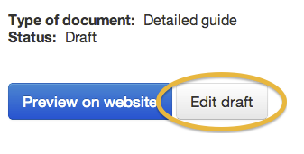

Please note this manual is a draft version and will be revised shortly.

# Edit a published document

From the document list or from your dashboard, click on a document title to view it.

Click 'Create new edition' to start a new draft version of your document for editing.

	
If a draft has already been created you'll see a button saying 'Go to latest edition' from which you'll be able to click 'Edit' and edit the document as normal.

Your document appears and you can now edit it.

### Published and draft versions of pages

If a published document is being edited, there will be 2 versions of it in Publisher: the live page (which cannot be edited) and the new version.

The new draft will overwrite the live page when it is published. All paths are updated and the old live page is archived and disappears from Publisher.

### Change notes
	
When you change a document, log what you’ve done in the ‘Change note’ field for transparency - this is publicly viewable. 

Enter something short but useful, beginning with a past tense verb.

The document will appear in the latest box on your organsiation home page and in email alerts and feeds. 

If the change is minor (eg fixing a typo or a broken link or making a style correction) then tick the ‘Minor change’ box. Minor changes won’t be flagged up publicly.

	
Users can read change notes by clicking the date of the article on the live page. 

	
It’s also a good idea to [add a remark internally](http://alphagov.github.io/inside-government-admin-guide/creating-documents/add-remarks.html) so other editors can see who requested the change and why. 

[< Back to contents](http://alphagov.github.io/inside-government-admin-guide/)
