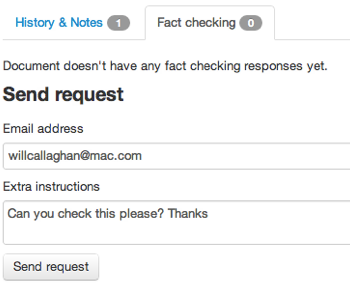
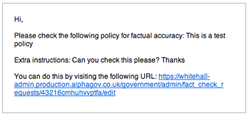
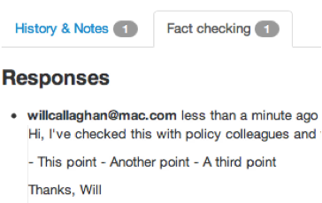

## Fact checking

1. We've made it easy for you to share documents with colleagues who don't have access to the Publisher.

	Just click the 'Fact checking' tab on the right of any document and write a message to your colleague.

	

2. Your colleague will receive an email with a link to click.

	This link takes them to a version of your page where they can leave comments.
	
	
	
3. When they've checked the page, you'll receive an email with a link to click. 
	
	This link takes you back to the Publisher where you can see their comments.

	