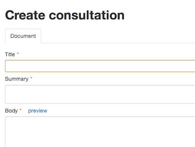
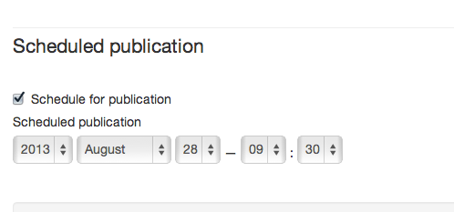
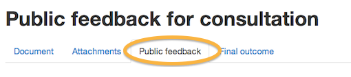
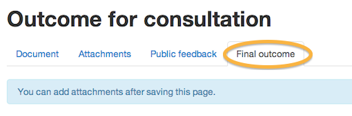

## Launch, update and conclude a consultation

Consultations stay on the same page of GOV.UK throughout their life cycle.

* The status changes automatically from open to closed on the closing date you specify, and the contact details disappear.
* The status changes from closed to concluded when you upload the government response or enter text in the detail box.

### Launch a consultation

* Create a consultation using the 'Create new document' menu.
* Add a title and summary and enter some body copy of no more than 100 words, summarising the call for responses. 

* Enter the opening and closing dates.
* Add the contact details for public responses under 'Ways to respond'.
* Schedule the publication for the opening date (you don't want the consultation to appear until it is open)

* Click 'Save and continue editing' and click on the attachments tab (this tab won't appear until you have saved the document).
* Upload the consultation document.
* Add links to supporting documents such as impact assessments in the body copy (impact assessments should be publications in their own right).
* Submit the consultation and ensure it goes to a [second pair of eyes](https://github.com/alphagov/inside-government-admin-guide/blob/gh-pages/creating-documents/launch-consultations.md).
* The second eye will need to click 'Schedule' in order for the consultation to go live at the scheduled time.

When the consultation reaches its closing date the status changes to 'Closed', with the message 'We are analysing your feedback'.

### Update a consultation

After the consultation has closed there may be some public feedback or other documents to add before the consultation process is fully concluded. 

* Don't change the original text - this will move to the bottom with the sub heading 'Original consultation'.
* Click on the 'Public feedback' tab and add text to summarise the update (maximum 100 words).

* Save your work.
* Upload the public feedback document (optional).

When the consultation is updated, the status remains as 'Closed'. The new content shows at the top of the page under the title 'Detail of feedback received'.

### Conclude a consultation

* Don't change the original text - this will move to the bottom with the sub heading 'Original consultation'.
* When the government response is ready, open the document for editing and click on the 'Final outcome' tab.

* Add text in the detail box to summarise the government's response or resulting actions.
* Save your work.
* Upload the response document (optional), or if it is a white paper or similar you need to create it as a publication and link to it from the detail box.

When the government response is added, the status changes to 'Outcome'. The new content shows at the top of the page under the title 'Detail of outcome'.

