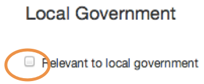

## Local gov alerts

1. Services previously provided by info4local.gov.uk have now moved to GOV.UK.

	
	
2. All documents in the publisher now have a local government checkbox.

	
	
	If the document you're publishing is relevant to local government, check this box.

	The content will then be surfaced in email alerts and feeds that can be accessed by local government colleagues.
