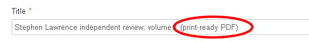
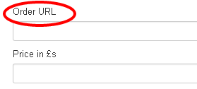
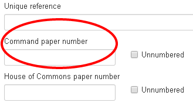
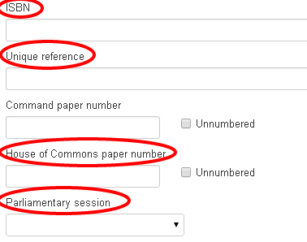
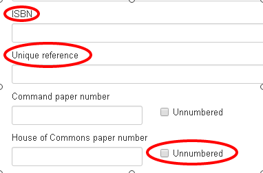

Please note this manual is a draft version and will be revised shortly.

# Creating an official document

Information about the [different types of official documents and how to prepare them for publication](http://nationalarchives.gov.uk/information-management/our-services/types-of-parliamentary-papers.htm) is available from the National Archives website.
 
You should have both the [web-optimised and print-ready PDFs](http://nationalarchives.gov.uk/information-management/our-services/publishing-parliamentary-papers.htm) ready to upload before you start.
 
Choose the publication type for the document you’re publishing eg policy paper, independent report. You should fill in the required fields as usual, you can use the [How to create a publication page](http://www.google.com/url?q=http%3A%2F%2Falphagov.github.io%2Finside-government-admin-guide%2Fcreating-documents%2Fcreate-a-new-doc.html&sa=D&sntz=1&usg=AFQjCNGgbHIDA4xQUz-A9dZxgpnBknlLRQ) guide if you’re not sure what to do.

Select the ‘save and continue editing’ button which gives you the option to upload attachments. When you’re ready to upload your PDF as an attachment select the attachments tab at the top of the page, then:

* fill in the title field with the name of the PDF
* if it’s a print-ready PDF you also need to add (print-ready PDF) in brackets after the title
* if it’s a web-optimised PDF, fill in the Order URL field with the link to the ‘How to buy print copies’ of official documents guide on GOV.UK: https://www.gov.uk/how-to-buy-printed-copies-of-official-documents
* leave the price field blank

Then fill in the rest of the fields according to the type of official document it is:

## Command papers

Fill in these fields:

* ISBN - web ISBN for the web-optimised PDF or print ISBN for print-ready PDF
* Unique reference - the departmental unique reference number (URN) - if the document has been given one
* Command paper number - write ‘Cm’ followed by the number eg Cm 8844

## House of Commons papers

Fill in these fields:

* ISBN – web ISBN for the web-optimised PDF or print ISBN for print-ready PDF
* Unique reference - the departmental unique reference number (URN) -if the document has been given one
* House of Commons paper number - found on the title page of the document (the HC prefix will be added automatically)
* Parliamentary session - select the correct session from the drop down menu, if you’re not sure which session it is you can check the [Parliamentary session calendar](http://www.google.com/url?q=http%3A%2F%2Fwww.parliament.uk%2Fabout%2Ffaqs%2Fhouse-of-commons-faqs%2Fbusiness-faq-page%2Frecess-dates%2F&sa=D&sntz=1&usg=AFQjCNGbLsQQzh-IXQOutEVUQAXDqn9hkA)

## Un-numbered Act papers

Fill in these fields:

* ISBN - web ISBN for the web-optimised PDF or print ISBN for print-ready PDF if the document has ISBNs
* Unique reference - the departmental unique reference number (URN) - if the document has been given one
* House of Commons paper number - leave the field blank and tick the box labelled ‘Unnumbered’

Then upload your attachment and save.
 
If you have both web-optimised and print-ready PDFs, list the web-optimised first on the page, followed by the print-ready versions.

[< Back to contents](http://alphagov.github.io/inside-government-admin-guide/)

