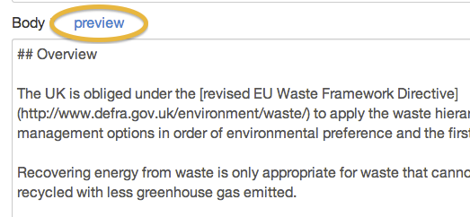

## Preview your work

1. You can preview the body copy of your document. Click on the 'preview' link at the top of the body field.

	

2. After a couple of seconds your content is shown as it will look when published.

	

	Click 'Edit' to return to editing.

3. You can also preview entire documents. Save your page and then click on the ‘Preview’ link.

	

	Your content opens in a new window or tab. Close it when you're done.

	

