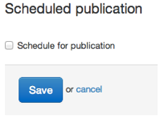
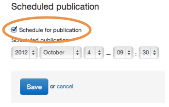
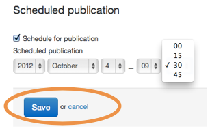
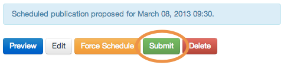

## Schedule a document for timed publication

Any document type (policies, news, speeches, consultations, publications) can be scheduled for publication. 

Click the 'Schedule for publication' checkbox and date/ time controls appear.

Set the date/ time you'd like the page to go live then save the page.

Click the ‘Submit’ button.

Content will only go live if:
	
* it is force scheduled (should only be used in emergencies)
* a colleague [second eyes](http://alphagov.github.io/inside-government-admin-guide/workflow-content/second-pair-of-eyes.html) the document more than 30 minutes prior to publication

If you use scheduled publishing a lot, it's a good idea to [read the blog post on the caching and exact timings](https://insidegovuk.blog.gov.uk/2013/07/12/caches-scheduled-publishing-and-consultations/) for successful publication.

