# Statistical announcements

Do not create or modify statistics or statistics announcements unless you have authorisation from the Office of National Statistics (ONS).

##How statistical announcements work

When you create a statistical announcement it generates a calendar entry on the [statistics release calendar](https://www.gov.uk/government/statistics/announcements). They are similar to calendar entries on the PubHub.

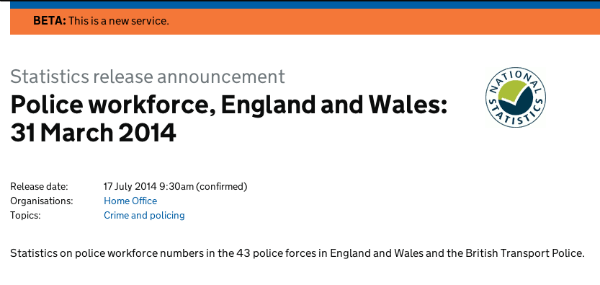

You should then create the draft publication in Publisher, linked to the announcement. Once the statistics document is published, the announcement will no longer show in the release calendar. You need to create a publication even if the statistics publication will not be published on GOV.UK.

##How to write text for a statistical announcement

If you’re creating a new announcement, first search GOV.UK for anything similar. You should match title style from previous publications where you can.

##Titles

A release title should:

* be under 65 characters 
* describe the statistics in the release in plain English 
* include the coverage and time the statistics relate to
* not include the word ‘statistics’ - it’s already on the page 
* be in sentence case 
* be [optimised for search](https://www.gov.uk/design-principles/style-guide/style-points#style-titles) (frontload the most important information)
* include colons instead of hyphens or dashes (for screen readers)
* not contain jargon or technical language
* spell out abbreviations or acronyms (unless well known, for example, UK, VAT or EU)

Good examples: 
'House building in England: October to December 2014’

‘UK overseas trade statistics: non-EU February 2014’

‘Cereal use by UK brewers, distillers and maltsters: November 2014’

Search engines cut off titles after about 65 characters. This can lead to unhelpful truncation.

##Summary

The summary gives more information about the statistic, and will show in most search engine results. It should:

* be under 140 characters (including spaces)
* expand on the title without repeating it
* explain what the release is about in plain English (no jargon)
* 'frontload' the most important information at the beginning (not 'This release provides...')
* end with a full stop (for people using screen readers)
* explain any acronyms used in the title

Examples:

‘Staff headcount by sector and industry for central and local government and public corporations.’

‘A breakdown of Jobseeker's Allowance claimant count statistics, after changes to eligibility rules for Income Support from November 2008.’

All text needs to be checked by the writer and another person before it is published, to avoid errors.

##Good example of a statistics release announcement

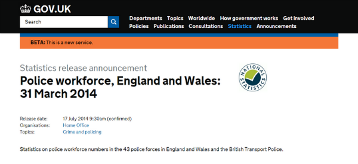

##How to publish a new statistics announcement 

Go to the ‘Statistics announcements’ tab in Publisher.

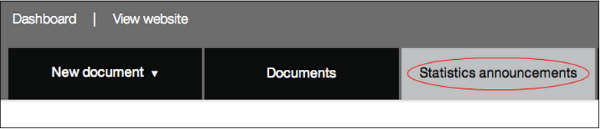

Use the ‘Create announcement’ button to start a new announcement.

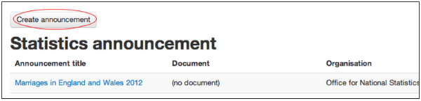

All of the fields with a ‘*’ are mandatory, so you need to fill them in following the GOV.UK style guide (link to above, ‘how to write text for a statistical announcement’).

Under ‘Statistics type’, only select the ‘National statistics’ option from the drop-down menu if your statistics are [accredited by ONS](http://www.statisticsauthority.gov.uk/national-statistician/types-of-official-statistics/list-of-national-statistics/index.html).

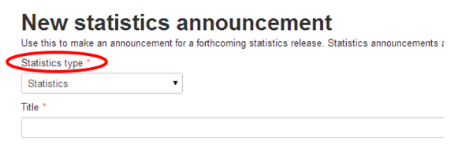

Once you’ve completed all the fields, select the ‘Save announcement’ button.

##How to amend an existing announcement

Go to the ‘Statistics announcements’ tab in Publisher.

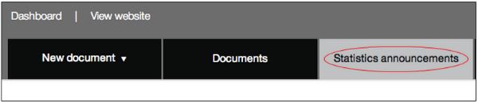

You’ll see a list of existing announcements. Select the announcement you want to edit.

To amend the statistics type, title, summary, organisation or topic:

* select the ‘Edit’ button
* make your amends
* have someone else check your text for errors
* select ‘Save announcement’

To amend the release date:

* select the ‘Change release date’ button
* once you’ve amended the date you have the option to [add a change note](https://insidegovuk.blog.gov.uk/2013/09/09/when-should-you-add-change-notes/) to explain the change of date - this will appear on the page for the public to read
* select ‘change date’ to confirm the change

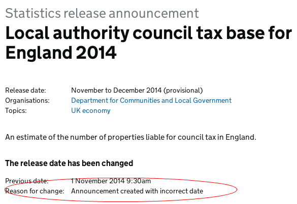

##How to link an announcement to a draft statistics publication

Once you’ve created your announcement you’ll see a message which says ‘This announcement is not yet linked to a document’. Underneath there are 2 options to link the announcement to a statistics document: 

* ‘Draft new document’ 
* ‘Link to an existing draft document’

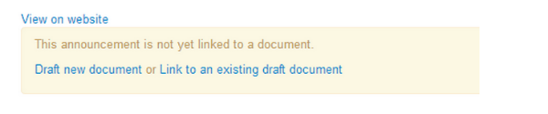

##Link to an existing draft document

If the draft of the statistics document is already in Publisher, then select ‘Link to an existing draft document.’ A search box will appear where you should enter the title of the document and select it from the list. This will link the 2 documents, so when you publish the statistics document, the announcement won’t show in the release calendar.

##Draft a new document

If the draft page for the document hasn’t yet been created you need to select ‘Draft new document’. This will automatically create a statistics publication page for your statistics document. Always search in Publisher first to make sure the document is not already there, and to make sure you have a unique title. 

It will auto-populate the publication type, title, summary and topic fields for you using the text from the announcement page. You will need to add the body text. Then you can save the page until you’re ready to upload the statistics publication.

##How to draft body text

The body text should reassure the user that the release is (or isn’t) what they’re looking for. The body text should:

* not be longer than 100 words
* describe what the statistics are about and their purpose
* be clear, concise and written in plain English
* provide context if there are statistics with similar titles
* not repeat the title and summary 
* not summarise what the publication says
* not include general information covered in the publication

##How to create a statistics publication to GOV.UK

Go to the ‘New document’ tab in Publisher and select ‘Publication’ from the drop down list. This will create a new publication page for you.

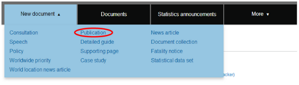

There are several mandatory fields you need to complete.

From the ‘publication type’ drop-down menu, select either ‘statistics’ or ‘statistics - national statistics’. Do not select ‘national statistics’ unless your statistics have been approved by ONS, as it will generate the national statistics logo on the document.

(IMAGE)

Complete the title and summary fields using the same wording you’ve used in the statistical announcement for this publication.

You then need to add the body text. This should reassure the user that it is (or isn’t) what they’re looking for. The body text should:

* not be longer than 100 words
* describe what the statistics are about and their purpose
* be clear, concise and written in plain English
* provide context if there are other similar statistics
* not repeat the title and summary 
* not summarise what the publication says
* not include general information covered in the publication

You must provide an email address for users to order the publication in an alternative format. Select your organisation’s address from the list.

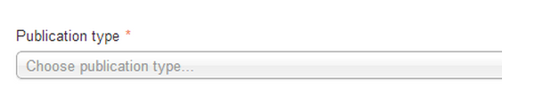

You also need to tag the publication to a topic, so choose the most appropriate one from the drop-down menu. You can add more than 1 topic if the publication covers a range of subjects.

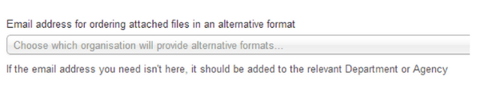

Statistics will not usually be tagged to a policy.

You should tag the publication to the relevant organisation(s).

If relevant, you can link the publication to a ‘Related statistical data set’.

Statistics are set by default to be visible only to publishers in the department that created them. Make sure you untick the box if you want to share the draft with colleagues in other departments.

Once you’ve finished completing the relevant fields you can save the document:

* if you don’t have the publication ready to upload select ‘Save’ and you can return to upload it later
* if you do have the publication ready to upload, select ‘Save and continue editing’

When the document is saved, a new tab will be available called ‘Attachments’. 

When you have your publication ready to upload, select the ‘attachments’ tab. Then select ‘Upload new file attachment’.

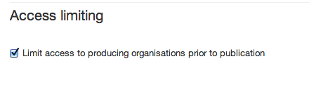

When you’ve uploaded your publication, go back to the ‘document’ tab, and select ‘Save’ (at the bottom of the page).

When the document is ready, you should select the ‘Submit for 2nd eyes’ tab. Another editor can now [review the page](https://insidegovuk.blog.gov.uk/2014/05/29/what-to-check-before-you-publish-a-2i-checklist/) to make sure it is in style and ready to be published. 

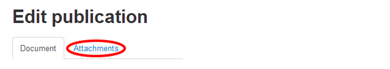

If they find anything that needs to be amended, they should ‘reject’ the page and add notes about what needs to change. You should then make the changes and resubmit for review.

If they’re happy with the page they can publish it immediately, or they can [schedule it to be published on a specific date](http://alphagov.github.io/inside-government-admin-guide/creating-documents/scheduled-publishing.html). (This is very useful when statistics must be published at a certain time, or if you won’t have another person available to review and publish it on the scheduled publication date). You cannot schedule publication for less than 30 minutes from the current time.
