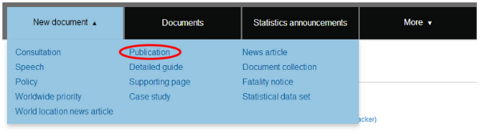
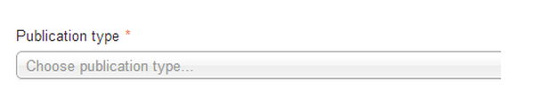
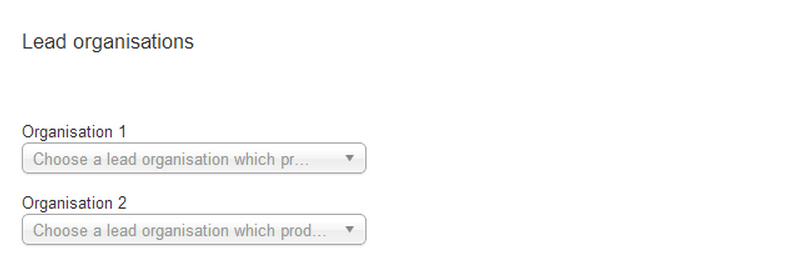
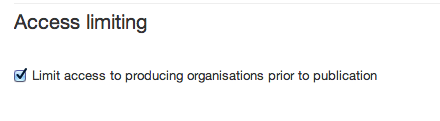
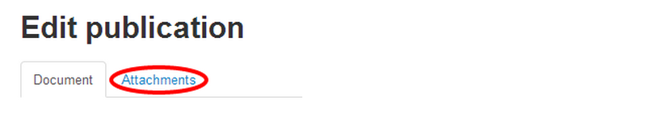

#How to create a statistics publication to GOV.UK

Go to the ‘New document’ tab in Publisher and select ‘Publication’ from the drop down list. This will create a new publication page for you.

There are several mandatory fields you need to complete.

From the ‘publication type’ drop-down menu, select either ‘statistics’ or ‘statistics - national statistics’. Do not select ‘national statistics’ unless your statistics have been approved by ONS, as it will generate the national statistics logo on the document.

Complete the title and summary fields using the same wording you’ve used in the statistical announcement for this publication.

You then need to add the body text. This should reassure the user that it is (or isn’t) what they’re looking for. The body text should:

* not be longer than 100 words
* describe what the statistics are about and their purpose
* be clear, concise and written in plain English
* provide context if there are other similar statistics
* not repeat the title and summary 
* not summarise what the publication says
* not include general information covered in the publication

You must provide an email address for users to order the publication in an alternative format. Select your organisation’s address from the list.

You also need to tag the publication to a topic, so choose the most appropriate one from the drop-down menu. You can add more than 1 topic if the publication covers a range of subjects.

Statistics will not usually be tagged to a policy.

You should tag the publication to the relevant organisation(s).

If relevant, you can link the publication to a ‘Related statistical data set’.

Statistics are set by default to be visible only to publishers in the department that created them. Make sure you untick the box if you want to share the draft with colleagues in other departments.

Once you’ve finished completing the relevant fields you can save the document:

* if you don’t have the publication ready to upload select ‘Save’ and you can return to upload it later
* if you do have the publication ready to upload, select ‘Save and continue editing’

When the document is saved, a new tab will be available called ‘Attachments’. 

When you have your publication ready to upload, select the ‘attachments’ tab. Then select ‘Upload new file attachment’.

When you’ve uploaded your publication, go back to the ‘document’ tab, and select ‘Save’ (at the bottom of the page).

When the document is ready, you should select the ‘Submit for 2nd eyes’ tab. Another editor can now [review the page](https://insidegovuk.blog.gov.uk/2014/05/29/what-to-check-before-you-publish-a-2i-checklist/) to make sure it is in style and ready to be published. 

If they find anything that needs to be amended, they should ‘reject’ the page and add notes about what needs to change. You should then make the changes and resubmit for review.

If they’re happy with the page they can publish it immediately, or they can [schedule it to be published on a specific date](http://alphagov.github.io/inside-government-admin-guide/creating-documents/scheduled-publishing.html). (This is very useful when statistics must be published at a certain time, or if you won’t have another person available to review and publish it on the scheduled publication date). You cannot schedule publication for less than 30 minutes from the current time.
