## Feature documents on your home page

Feature documents on your home page to draw attention to current stories or important publications or announcements. 

Each organisation can feature up to 6 documents (eg news stories, publications, speeches, consultations) on its homepage. 

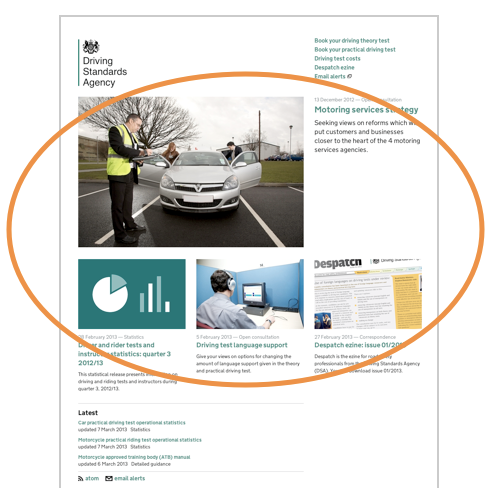

* In Publisher click on your organisation's name in the top navigation - you'll be taken to your department hub. 
* Click on the 'Featured documents' tab.
	
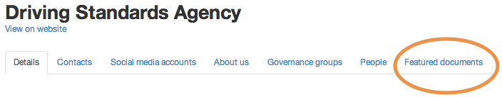
	
* Pick the content you'd like to feature.
* Upload an image to go with that feature (it must be 960 x 640 pixels, landscape).

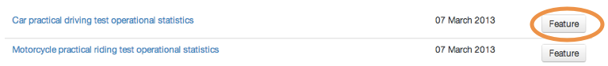
	
You can change the order of featured documents. The first document featured will be the most prominent, then you can feature up to 5 more - they will slot into place below the first feature leaving no gaps.

* Click and drag an item up or down in the list.
* When you're done setting the order, click 'Save'.

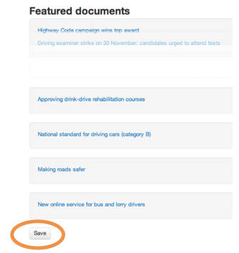
	
* Click 'Unfeature' to remove featured documents from the home page, making space for new ones.

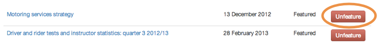
	

### Top right links, What we do, Topics, Ministers and Managers

1. All these sections can be edited via the Publisher. 

	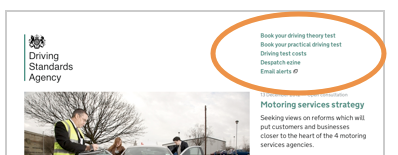
	
	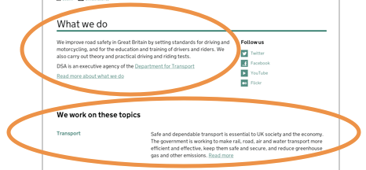
	
	
	
	The controls for these homepage sections are all in the same place. Click on your organisation's name in the top nav.
	
	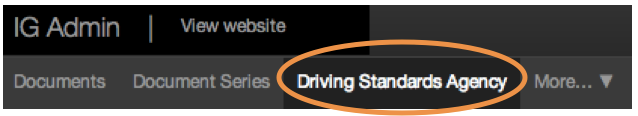
	
	Then scroll down the page and click the 'Edit' button.
	
	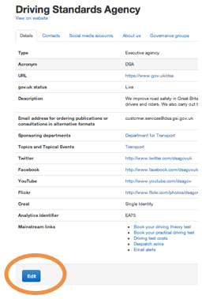	
	
2. Change the links top right by editing the 'Mainstream links' section.

	These links should only be used for the most popular tasks performed by your users. GDS may remove other types of links. If in doubt please talk to us.

	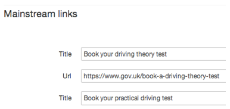	
	
3. Change the 'What we do' content by editing the 'Description' field.

	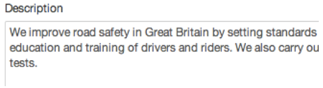	
	
4. Feature topics using the topic drop down menus.

	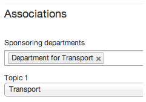	
	
5. Drag people's names up and down to reorder them.

	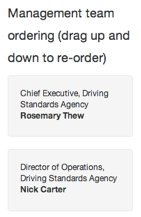	
	
	
### Social media accounts

1. You can add social media accounts to your homepage.

		

2. Click on the 'Social media' tab.

	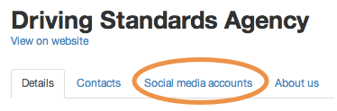	
	
3. Delete, edit and add new accounts as needed. 

	Accounts are shown in the order you add them.

	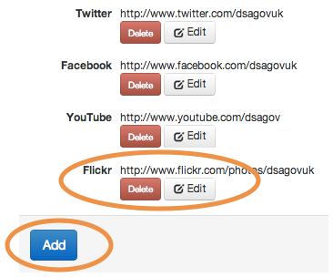	
	

### Contacts

1. You can add as many contacts as needed.

	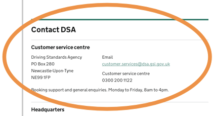	
	
2. Click on the 'Contacts' tab.

	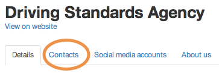	
	
3. Delete, edit and add new contacts as needed. Contacts are shown in the order you add them.

	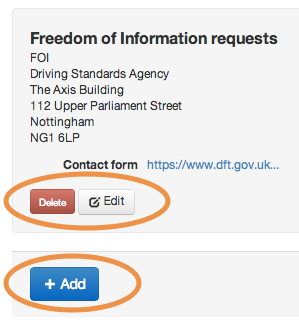	

	
### Corporate info pages

1. You can add corporate information pages.

	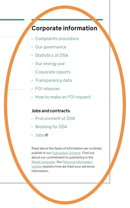	
	
2. Click on the 'Corp info' tab.

	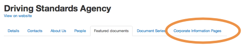	

3. Delete or add new corporate info pages as needed.

	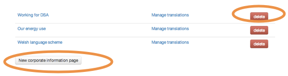	
	
4. Pick a type (you can only use each type once), write your copy and save when you’re done.

	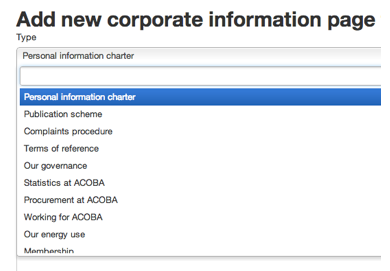	
