## Homepage

### Featured documents

1. Each organisation can feature up to six documents (eg news stories, speeches, consultations) on its homepage.

	

2. In Publisher click on your organisation's name

	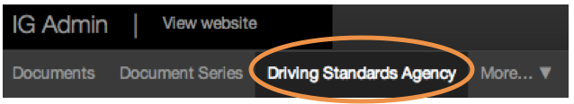
	
	You'll be taken to your department's 'about us' pages. Click on the 'Featured documents' tab.
	
	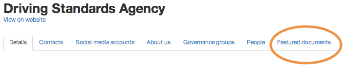
	
3. Pick the content you'd like to feature.

	
	
4. You can change the order of Featured documents.

	Click and drag an item up or down in the list.
	
	When you're done setting the order, click 'Save'.

	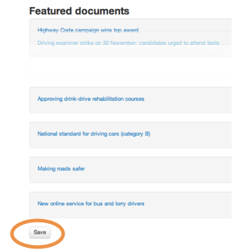
	
5. You can also unfeature content easily.

	Click 'Unfeature' to remove content from the homepage.

	
	

### Top right links, What we do, Topics, Ministers and Managers

1. All these sections can be edited via the Publisher. 

	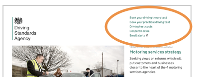
	
	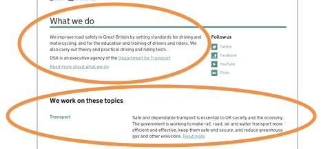
	
	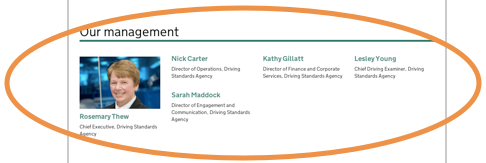
	
	The controls for these homepage sections are all in the same place. Click on your organisation's name in the top nav.
	
	
	
	Then scroll down the page and click the 'Edit' button.
	
	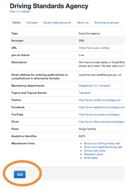	
	
2. Change the links top right by editing the 'Mainstream links' section.

	These links should only be used for the most popular tasks performed by your users. GDS may remove other types of links. If in doubt please talk to us.

		
	
3. Change the 'What we do' content by editing the 'Description' field.

	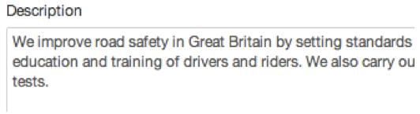	
	
4. Feature topics using the topic drop down menus.

	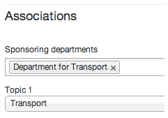	
	
5. Drag people's names up and down to reorder them.

	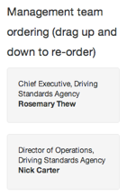	
	
	
### Social media accounts

1. You can add social media accounts to your homepage.

		

2. Click on the 'Social media' tab.

	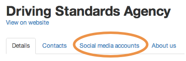	
	
3. Delete, edit and add new accounts as needed. 

	Accounts are shown in the order you add them.

		
	

### Contacts

1. You can add as many contacts as needed.

	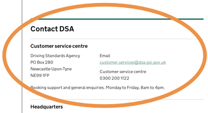	
	
2. Click on the 'Contacts' tab.

	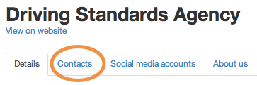	
	
3. Delete, edit and add new contacts as needed. Contacts are shown in the order you add them.

	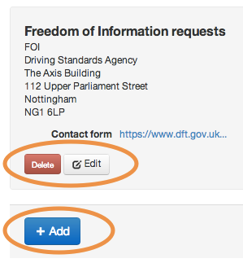	

	
### Corporate info pages

1. You can add corporate information pages.

		
	
2. Click on the 'Corp info' tab.

		

3. Delete or add new corporate info pages as needed.

	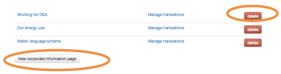	
	
4. Pick a type (you can only use each type once), write your copy and save when you’re done.

		
