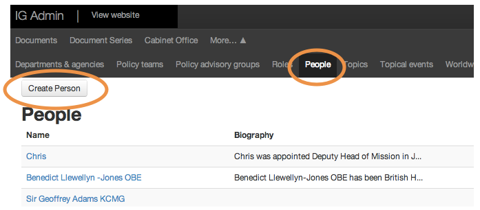
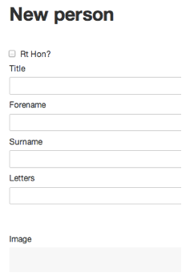
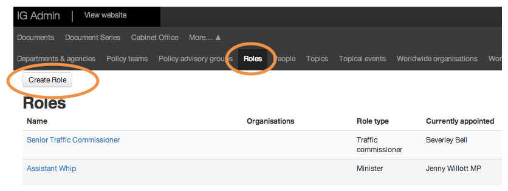
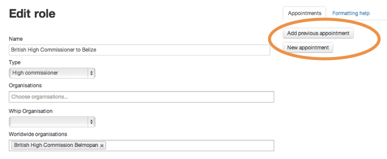

## People and roles

1. People and roles are covered by two separate sections of the Publisher.

	Click the 'People' tab to see a list of every person featured on GOV.UK.
		
	Click 'Create person' to create a new person.

	

2. New people need a title, forename, surname, image and biography.

	Images must be 960 x 640 px.
	
	
	
3. When a person is created, you can associate it to a role.

	Click the 'Roles' tab to see a list of every role featured on GOV.UK.
	
	Click 'Create role' to create a new role.
	
	Please check with GDS before creating any ministerial roles or people.
	
	
	
4. You can add new appointments or previous ones.

	Click one of these buttons to add a new appointment or a previous one.
	
	
	
5. Now choose a person and set the date they started in the role.

	Both the role and the person need to be saved before you can associate them.

	