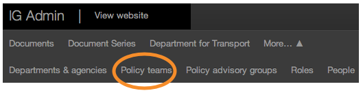
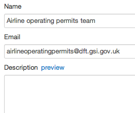
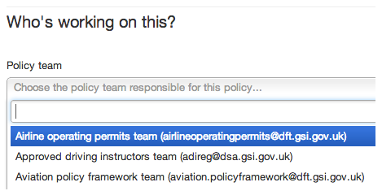
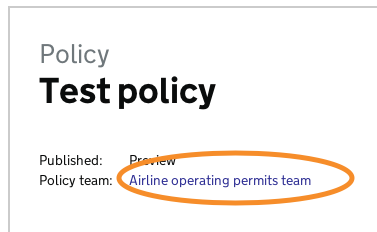

## Policy team

1. Policy teams can have their own pages on Inside Government, linked from the policies they work on.

	To create one, click on ‘Policy teams’.

	
	
	Then click on ‘Create policy team’.
	
	
	
2. Enter the name, email address and description of the policy team and then click ‘Save’. 

	Any changes made to these pages will go live as soon as you save them. So double check everything before you click ‘Save'.
	
	
	
3. Go to the policy page where you would like to add the team, then click ‘Edit’.

	Scroll down to ‘Who’s working on this?’ and pick the policy team you want.

	When you’re done click ‘Save’.

	

4. Preview the page and you’ll see there’s a link to the policy team’s page.

	