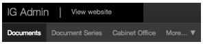

## Other content you can edit

Use the top nav to create and edit these types

 
   

### Organisation homepage

Collects together featured stories, latest content, ‘what we do’ description, policies, topics, key people and contact information.

[Example](https://www.gov.uk/dft)

[Instructions](homepage.html)

### About us

A page for each department that includes headings for what we do, responsibilities, priorities, who we are, corporate information and corporate reports.

[Example](https://www.gov.uk/government/organisations/department-for-transport/about)

[Instructions](homepage.html)

### Corporate information

Single pages designed specifically for the following information:

* [Personal information charter](https://www.gov.uk/government/organisations/department-for-transport/about/personal-information-charter) for standards followed by orgs when asking for info (required)

* [Publication scheme](https://www.gov.uk/government/organisations/department-for-transport/about/publication-scheme) lists the information the org routinely makes available (required)

* [Complaints procedure](https://www.gov.uk/government/organisations/department-for-transport/about/complaints-procedure) (required)

* [Our governance](https://www.gov.uk/government/organisations/foreign-commonwealth-office/about/our-governance) describes the boards and committees that run the organisation

* [Statistics at x](https://www.gov.uk/government/organisations/department-for-transport/about/statistics) includes a forward look at releases and explains how the org compiles stats

* [Procurement](https://www.gov.uk/government/organisations/ministry-of-defence/about/procurement) offers information for potential suppliers

* [Working for x](https://www.gov.uk/government/organisations/ministry-of-defence/about/recruitment) provides direct links to job listings and any relevant recruitment or HR policies

* [Our energy use](https://www.gov.uk/government/organisations/hm-revenue-customs/about/our-energy-use) links to the org’s energy use data (generally central headquarters)

* [Welsh language scheme](https://www.gov.uk/government/organisations/wales-office/about/welsh-language-scheme) for orgs providing services in Wales

* Office access and opening times

[Instructions](homepage.html)

### Document series

Collects together any other content type (eg statutory guidance on admissions for headteachers). Not surfaced anywhere, you need to link to them.

[Example](https://www.gov.uk/government/organisations/hm-revenue-customs/series/briefings)

[Instructions](document-series.html)

### Role

A particular position in government, what duties the role entails and its responsibilities. Used for senior leadership team only.

[Example](https://www.gov.uk/government/ministers/prime-minister)

[Instructions](people-and-roles.html)

### Person

The name of the individual in a particular role, along with their biographical information and photograph. Used for senior leadership team only.

[Example](https://www.gov.uk/government/people/david-cameron)

[Instructions](people-and-roles.html)

### Field of operation

Ministry of Defence only. Used to group fatality notices by territory.

[Example](https://www.gov.uk/government/fields-of-operation/afghanistan)

### Sub-organisation

By agreement with GDS. A high profile unit that has sufficient public profile and publishing activity in its own right to warrant an org-lite presence, nested beneath its parent body.

[Example](https://www.gov.uk/government/organisations/defence-equipment-and-support)

[Instructions](sub-organisation.html)

### Policy team

Description and contact details of a team working on a policy.

[Instructions](policy-team.html)

### Policy advisory group

Description, contact details and attached meeting papers of a group or commitee which has input to a policy. Can be made up of external experts or stakeholders.

[Instructions](policy-advisory-group.html)

### Governance group

Used to show memberships of top level governance boards. Easy to show senior roles and people within your organisation.

[Instructions](governance-group.html)

