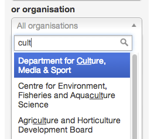
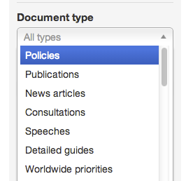

## Document filters

1. Use the filters down the left hand side of the page to find the document you want.

   
   
2. You can search all documents. 

   Type in a phrase and hit return.
   
   The list of documents will update to show any titles that match

   
   
3. You can filter any documents by any author or organisation.
   
   Click on 'Me' for your documents.
   
   Click on 'My department' for anyone in your team. Use the dropdown menu for other organisations.
   
   Click on 'Everyone' to see all documents. Use the dropdown menu for other authors.
   
   

4. You can search for authors and organisations.
   * Start typing the author or organisation name and suggestions will appear. Just pick the name you want.
   * Alternatively, don't type anything and just scroll up and down the list looking for the name you want.

   
   
   
   

5. You can filter documents by their world location (generally a country).

   Start typing a world location into the search box. Or click on it to open a dropdown menu you can pick from.

   
   
6. You can filter documents by their type.

   Click on ‘Policies’ and the document list will update to show only policies.
   
   Click ‘All’ to see every document type again.

   

7. You can also filter documents by their state (eg draft, published, everything)

   
   
   ‘All’ shows every document.
   
   'Imported (pre-draft)' is used by departments in transition. Click on it to see documents that have been imported that you need to tag and tidy.
   
   'Drafts' shows documents that are a work in progress.
   
   'Submitted' shows documents waiting for a second pair of eyes to look at. You should ordinarily submit documents rather than publish them yourself.
   
   'Rejected' shows documents that have been rejected by a second pair of eyes.
   
   'Scheduled' lists documents that are scheduled to be published at a specified date and time.
   
   'Published' shows every document that’s live on Inside Government.
