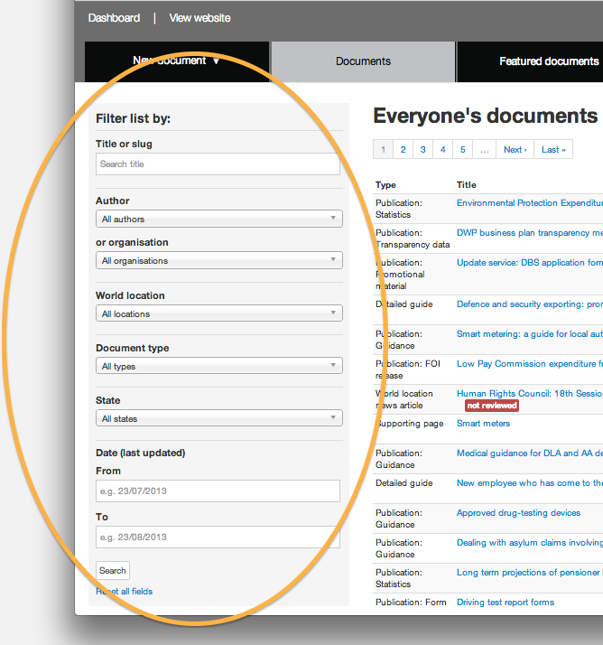
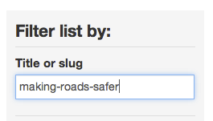

## Document filters

2. Use the filters down the left hand side of the page to find the document you want.

   
   
3. You can search all documents. 

   Type in a phrase and hit return.
   
   The list of documents will update to show any titles that match

   
   
4. You can filter any documents by any author or organisation.
   
   Click on 'Me' for your documents.
   
   Click on 'My department' for anyone in your team. Use the dropdown menu for other organisations.
   
   Click on 'Everyone' to see all documents. Use the dropdown menu for other authors.
   
   

5. You can search for authors and organisations.

   Start typing the author or organisation name and suggestions will appear. Just pick the name you want.

   Alternatively, don't type anything and just scroll up and down the list looking for the name you want.

   
   
   
   
