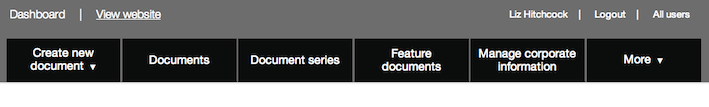
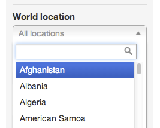

## Find documents - using the filters on Publisher

Click on the 'Documents' link on the top navigation to get to the full list of documents on GOV.UK. 

There are thousands of documents on GOV.UK. The filters down the left hand side of the page help you to narrow down the list to find the document you want.

You can use just one filter or several - they will all act together.

### Filter by title or slug

You can filter using consecutive words from the document's title or the slug of the public-facing URL on GOV.UK (for example 'making-roads-safer').

The search filters the text to find the words you type. Type in consecutive words from the title or a slug (including hyphens) and hit return.

### Filter by author or organisation

You can filter documents by any department or agency, or you can find documents that have been created or edited by yourself or other colleagues.

* Click on 'Me' to bring up documents that you have created or edited.
* Click on 'My department' for all documents written by members of your team. 
* Use the dropdown menu for other organisations, or start typing the organisation name to find them more quickly.

* Click on 'Everyone' to see all documents. 
* Use the dropdown menu for other authors, or start typing a colleague's name to find them more quickly.

### Filter by world location   

Government offices overseas can filter documents by their world location (generally a country).

* Start typing a world location into the search box. 
* Click on the search box to open a dropdown menu you can pick from.

### Filter by kind

You can filter documents by their type (publication, policy, news article etc).

* Click on ‘Policies’ and the document list will update to show only policies.
* Click ‘All’ to see every document type again.

### Filter by state

You can filter documents by their state (draft, scheduled, published etc).

* ‘All’ shows every document.
* 'Imported (pre-draft)' is used by departments and agencies in transition. Click on it to see documents that have been imported ready for editing.
* 'Drafts' shows documents that are a work in progress.
* 'Submitted' shows documents waiting for a second pair of eyes to look at them. You should always submit documents rather than publish them yourself except when you are obliged to [force publish](http://alphagov.github.io/inside-government-admin-guide/workflow-content/second-pair-of-eyes).
* 'Rejected' shows documents that have been rejected by a second pair of eyes.
* 'Scheduled' lists documents that are scheduled to be published at a specified date and time.
* 'Published' shows every document that’s live on GOV.UK.

[< Back to contents](http://alphagov.github.io/inside-government-admin-guide/)
