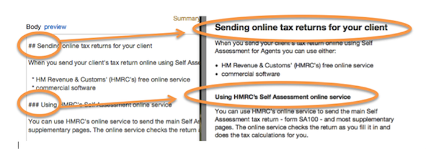

## Markdown

1. Most pages in the publisher use ‘Markdown’ to format the content. Rather than using editor tools or coding in html, you can add simple commands within the text to create the formatting you want. Wherever you are editing, you’ll see a ‘how to’ guide like the one below. It’s under the tab called ‘Formatting help’. You can cut and paste the text if you get stuck.

   
   
   Here's some temporary guidance for creating internal links. You can use admin urls for some internal links, but not for others. We'll make this simpler to follow shortly.
   
   
   
   Short youtu.be urls also work here.  
      
   
   
   Here’s some new markdown for adding attachments as links rather than the big boxes with cover images as we’ve used until now.
   
   
   
   Check out this new markdown for Addresses. For now, leave mailto: links outside of $A as links don’t render within them. We’ll fix this later.
