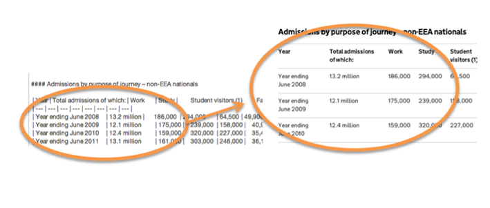
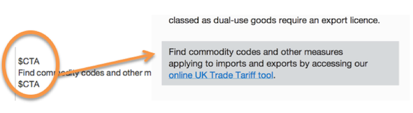

## Markdown

*  The publishing system uses ‘Markdown’ to format the content. Rather than using editor tools or coding in html, you can type simple commands within the copy to create the formatting you want. 
*  Wherever you are editing, you’ll see a ‘how to’ guide like the one below. It’s under the tab called ‘Formatting help’. You can cut and paste the text if you get stuck.

   
### Headers and sub-headers

*  Use 2 hashtags (\##) for a section header and 3 or 4 hashtags for sub-headers. These are your H2s, H3s and H4s.
*  Don't use 1 hashtag or you will get a title heading in the middle of your document - the box where you enter the title will assign it the H1 style automatically, you don't need to use Markdown in this box.

*  Use the headers in sequence, ie an H3 needs to be preceded by an H2 and an H4 needs an H3.

The [Create a document](http://alphagov.github.io/inside-government-admin-guide/creating-documents/creating-a-new-doc.html) section has more about titles, summaries and sub-headers.

### Links

*  Use square brackets for the link text and round brackets for the link URL.
*  Make sure there are no spaces between the brackets.

The [Add links](http://alphagov.github.io/inside-government-admin-guide/creating-documents/add-links.html) section explains how to create internal and external links. 

### Bullets

*  Use asterisks (\*) to make bullets (hyphens also work).

*  Make sure there is 1 space after the asterisk and that all the bullets line up. 
*  You need 1 empty line space before the bullets start, and 1 at the end.
*  Sub-items need an indent of 2 spaces.

See the [style guide, section 2.5](https://www.gov.uk/designprinciples/styleguide#bullet-points-and-steps) to check how to punctuate bullets.

### Tables

*  Use dividers (\|) to make tables.
*  You need 1 empty line space before the table starts and 1 at the end.
*  Make sure every row has the same number of dividers - use \| | for an empty cell.

*  Use \|---|---| as the second row to create a bold header row at the top.
*  No Markdown within a table, but you can use html if you need links in your table.

### Call to action

*  Use $CTA to make a tinted box to draw attention to a call to action.
*  This is only for short links to purposeful actions like applying for a licence.
*  

See the [style guide, section 2.15](https://www.gov.uk/designprinciples/styleguide#links) for more advice about writing links.

### Acronyms

Acronyms like Rural Payments Agency (RPA) should be spelt out on the first mention with the acronym in round brackets. Use the acronym on its own throughout the rest of the document - RPA - and put your Markdown at the end. 

The full name will show as alt text when the user hovers over the acronym where it appears in the text.

*  Leave 1 empty line space then list acronyms, each one on a new line at the base of the document.
*  For each acronym, type an asterisk, square brackets and a colon - \*[SAD]: Single Administrative Document - and then the full name.

*  Make sure there is no space between the asterisk and the square brackets.
*  List both plurals and singulars, but not possessives like DFT's.
*  List plurals ahead of singulars (eg HGVs must be before HGV).
*  No need to list acronyms that appear only once.

### Images and attachments

Covered in the sections [Add images](http://alphagov.github.io/inside-government-admin-guide/creating-documents/add-images.html) and [Add attachments](http://alphagov.github.io/inside-government-admin-guide/creating-documents/add-attachments.html)

