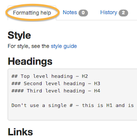

## Markdown

*  Most pages in the publisher use ‘Markdown’ to format the content. Rather than using editor tools or coding in html, you can add simple commands within the text to create the formatting you want. 

*  Wherever you are editing, you’ll see a ‘how to’ guide like the one below. It’s under the tab called ‘Formatting help’. You can cut and paste the text if you get stuck.

   
   
### Headings and sub-headings

Use 2 hashtags for a main heading and 3 or 4 hashtags for sub-headings.

### Links

### Bullets

### Tables

### Call to action

### Acronyms

