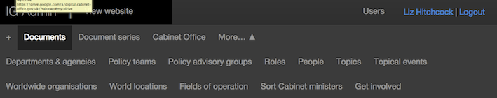

## Top navigation

Use the top navigation to access content that's about your department (eg your homepage, contact details, policy teams etc). 

* Click on 'IG Admin' to go to your dashboard.
* Click on ‘Documents’ to go to the document hub.
* Click on 'View website' to visit the live GOV.UK website.
* 'Document series' let you collect related content together (eg ‘spending over £25,000’ or ‘statutory guidance for headmasters on admissions’)
* Click on your organisation's name to manage your homepage etc. If the wrong organisation is shown here please get in touch and we’ll fix it.
	
	
Click the 'More' link to see more content managed sections.

* Click any of these links to see lists of content in each section. Some of this content is edited by you, other parts carry a message to ask GDS to carry out or approve content creation. 

	
	
