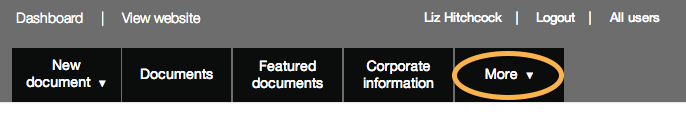
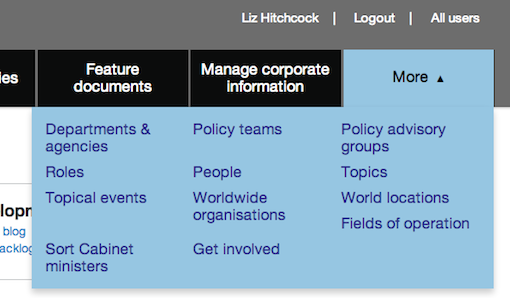

## Find your way around Publisher

Use the top navigation to access content that's about your department (eg your home page, contact details, policy teams etc). 

From the top navigation you can:

* click to [create a new document](http://alphagov.github.io/inside-government-admin-guide/creating-documents/create-a-new-doc.html)
* click on ‘Documents’ to go to the documents list - [find out how the document filters work](http://alphagov.github.io/inside-government-admin-guide/first-steps/find-documents.html)
* click on 'Document series' to organise or create [document series](http://alphagov.github.io/inside-government-admin-guide/organisations-groups/document-series.html) for your organisation
* click on 'Feature documents' to [select content for your organisation's home page](http://alphagov.github.io/inside-government-admin-guide/organisations-groups/feature-documents-home-page.html)
* click on 'Manage corporate information' to [manage your home page](http://alphagov.github.io/inside-government-admin-guide/organisations-groups/organisation-home-page.html), corporate pages, people and groups. If the wrong organisation is shown here please get in touch and we’ll fix it

Click the 'More' link to see more sections.

Additional menu items will appear.

Click any of these links to create or further edit your organisation's content. Sometimes you'll need to ask GDS to carry out or approve content creation. You'll see a message in red if this is the case.

You may not create or edit any content that is not the responsibility of your organisation. 

[< Back to contents](http://alphagov.github.io/inside-government-admin-guide/)

	
