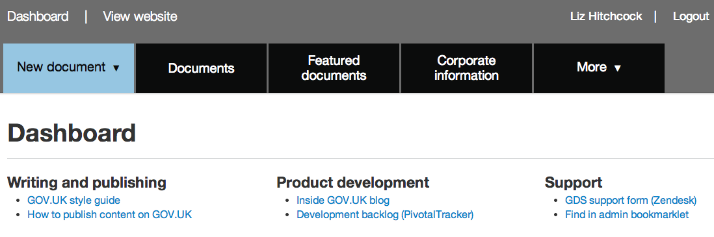

## Your dashboard

When you log into Publisher the first screen you see is your dashboard. 

   

From your dashboard there are links to support tools.

Underneath this, your dashboard lists the most recent draft documents you have been working on and your organisation's force-published documents (which need ['second eye'](http://alphagov.github.io/inside-government-admin-guide/creating-documents/second-pair-of-eyes.html).

Using the [top navigation](http://alphagov.github.io/inside-government-admin-guide/first-steps/top-navigation.html), you can:

*  create new content 
*  click through to 'Documents', which lists all documents produced by departments and agencies, with a set of [document filters](http://alphagov.github.io/inside-government-admin-guide/first-steps/document-filters.html)
*  click through to 'Document series'
*  click through to 'Your organisation', which is where you control the [home page](http://alphagov.github.io/inside-government-admin-guide/editing-other-pages/homepage.html) for your department or agency

   
