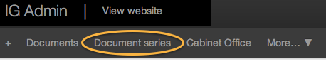
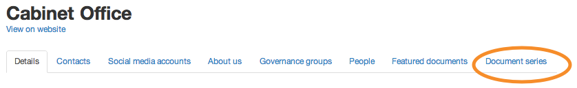
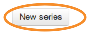
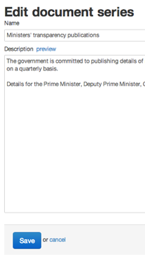
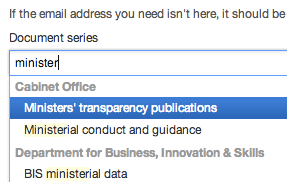
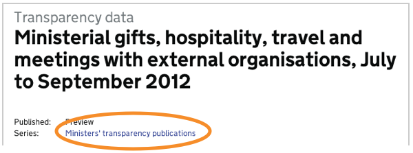

## Document series

1. You can group related documents together by creating series.

	Click on your organisation's name.
	
	
	
	Click on ‘Document series’.

	

	Then click on ‘New series’.

	

	
2. 	Next give your series a name and description. When you’re done click ‘Save’.

	Any changes made to these pages will go live as soon as you save them. So double check everything before you save it.

	
	
3. Go to the document that you’d like to add to the series and click ‘Edit’.

	Scroll down to Associations and pick the name of your new series from the ‘Document series’ drop down menu.

	When you’re done click ‘Save’.

	

4. Preview the page and you’ll see that it shows that this publication is part of a series.

	Click this link to see more documents in this series.
	
	

	
