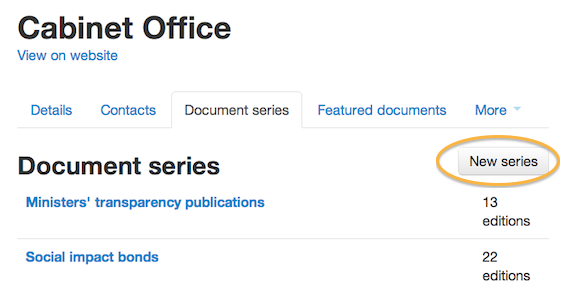

## Document series - create and populate, or delete

You can group related documents together by putting them into document series. There are 2 stages to this - creating the series and then populating it.
	
### Create a new document series

* Click on ‘Document series’.

* To edit the title or summary, click on the name.
* To create a new series click on ‘New series’.

* Give your series a title and description and click ‘Save’.

Document series go live as soon as you save them. 

### Populating document series	

* Go to the first document that you’d like to add to the series and click ‘Edit’.
* Scroll down to 'Associations' and pick the name of your new series from the ‘Document series’ drop down menu.
* When you’re done click ‘Save’.
* To remove the document, click on the cross.

* Preview the page and you’ll see that it shows that this publication is part of a series.
* Click this link to see more documents in this series.
	

### Delete a document series

Before a document series can be deleted it needs to be empty. You will need to remove each document individually by removing the series from its associations.

* Click on ‘Document series’.

* Find the series you want to delete (it should say 0 editions).
* Click on the name to edit it.
* Click the red 'Delete' button.
	
