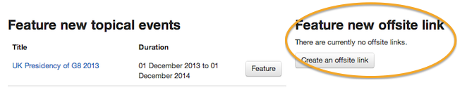

# Feature content on your home page

Feature content with photos on your home page to draw attention to current stories or important publications or announcements. 

Each organisation can feature up to 6 pieces of content (eg collections, detailed guides, news stories, publications, speeches, consultations) on its home page. 

You can feature:

* content items that exist within the Departments and Policy area of GOV.UK
* topical events

You can also feature links to content that sits outside Publisher. These are:

* blogposts
* alerts
* campaigns
* services
* careers

You can only feature links to .gov.uk domains and the majority of your featured links should point to destinations within GOV.UK.

* In Publisher click on your organisation's name in the top navigation - you'll be taken to your department hub. 
* Click on the 'Features' tab.

## Feature GOV.UK content

* Pick the content you'd like to feature. 
* Upload an image to go with that feature (it must be 960 x 640 pixels, landscape).

## Feature external content

* Create an external link. 
* Upload an image to go with that feature (it must be 960 x 640 pixels, landscape).

## Change the order featured content

You can change the order of featured content. The first piece of content you feature will be the most prominent. You can feature up to 5 more - they'll slot into place below the first feature leaving no gaps.

* Click and drag an item up or down in the list.
* When you're done setting the order, click 'Save ordering'.

## Unfeature 

* Click 'Unfeature' to remove featured content from the home page, making space for new ones.

[< Back to contents](http://alphagov.github.io/inside-government-admin-guide/)

	
