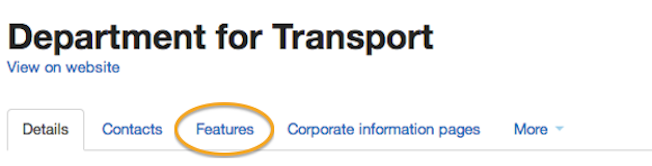
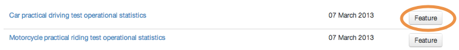
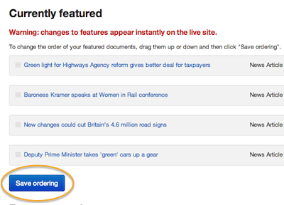
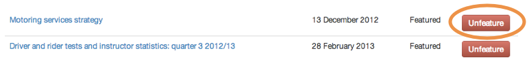

## Feature documents on your home page

Feature documents with photos on your home page to draw attention to current stories or important publications or announcements. 

Each organisation can feature up to 6 documents (eg news stories, publications, speeches, consultations) on its home page. 

* In Publisher click on your organisation's name in the top navigation - you'll be taken to your department hub. 
* Click on the 'Featured documents' tab.

* Pick the content you'd like to feature.
* Upload an image to go with that feature (it must be 960 x 640 pixels, landscape).

You can change the order of featured documents. The first document featured will be the most prominent, then you can feature up to 5 more - they will slot into place below the first feature leaving no gaps.

* Click and drag an item up or down in the list.
* When you're done setting the order, click 'Save'.

* Click 'Unfeature' to remove featured documents from the home page, making space for new ones.

	
