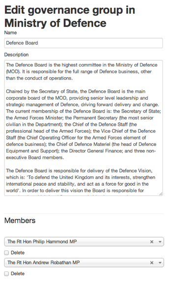

## Governance group

1. Governance groups are used to show memberships of the top level boards and commitees within your organisation. 

	To create one, click on your organisation name.
	
	
	
	Then click on ‘Governance groups’.
	
	
	
2. You can add, edit or delete groups.

	Groups can only be deleted if they have no members
	
	
	
3. Add a name, description and members.

	Any changes made to these pages will go live as soon as you save them. So double check everything before you click ‘Save’.
	
	
	
4. You need to link to these pages as they’re not surfaced anywhere at present.

	