## Organisation home page and ‘What we do’

Click on your organisation name to open your home page hub. 

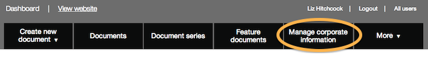 
   
From this hub you can edit the text on your home page, set your home page status, add corporate pages and write the text for 'What we do'.

* From your organisation hub, click 'Details' tab.
* Scroll down and click on the blue 'Edit' button.
* Check your organisation's status on GOV.UK (this is below the description field and above 'Associations'). 

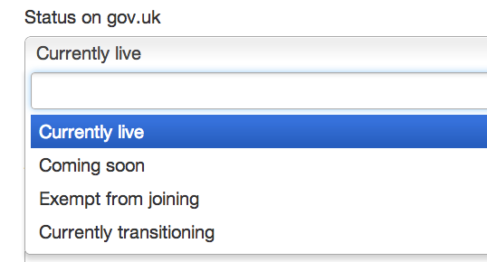 

#### Organisations in transition

**Do not change the status to 'Live' unless your organistion is due to launch and you have agreed this with your transition manager**

* If you make changes to the 'Name', 'Logo' or 'Description' fields these will appear immediately on the live site.
* With the status set to 'Coming soon' or 'Currently transitioning' you can make changes below the status field that will not appear on the live site.

#### Organisations that have gone live

**Do not change the status from 'Live' to anything else or your organisation will disappear from GOV.UK**

* If you make changes to any part of the details - 'Name', 'Logo', 'Description' or 'About us', these changes will appear instantly on the live site.

### Complete the details 

* From your organisation hub, click 'Details' tab.

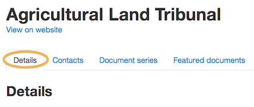 

* Scroll down and click on the blue 'Edit' button.

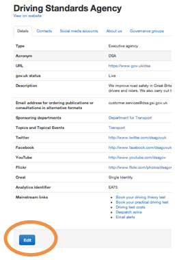   

The first part of the details will already be complete. Let your transition manager know if you need to change anything. 

* You will need a default image for news articles. Upload this by clicking the 'Choose file' button. You need a jpeg, gif or png file of a generic photo that reflects your organisation, size 960 x 640 pixels, minimum 75 dpi.
* There is no need to delete your old URL from the details, this will disappear once your organistion has launched.
* You will need an email address for ordering publications or consultations in alternative formats: find out what it is if this is not filled in.
* You will need to show your sponsoring department or agency, and the topics and categories where your organisation has responsibilities. Fill these in after consultation with your sponsoring organisation.

### Add Mainstream links

Change the links top right by editing the 'Mainstream links' section.

These links should only be used for the most popular tasks performed by your users. GDS may remove other types of links. If in doubt please talk to us.

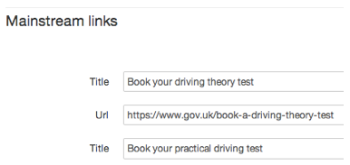

### Write the 'What we do' section

Refer to the [style guide 6.0: What we do](https://www.gov.uk/designprinciples/insidegovernment#what-we-do) for guidance on how to write this section.

* 'What we do' is the short summary in a large font that appears on your home page. It comes from the 'description' field at the top of the details page and does not need to be repeated.
* Scroll down to the bottom of the 'Details' tab: in the 'About us' box, write your organisation's priorities, responsibilities and 'Who we are' content.
* Use [Markdown](http://alphagov.github.io/inside-government-admin-guide/creating-documents/markdown.html) to format your text.

### Add contacts

* From your organisation hub, click 'Contacts' tab.

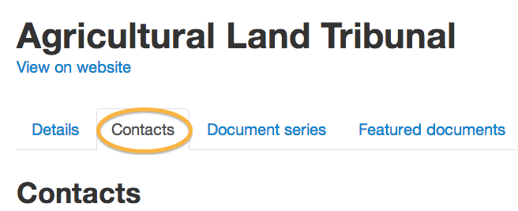 

* Edit the existing contact details and add new ones as needed to appear on your home page. 
* Delete, edit and add new accounts as needed. Accounts are shown in the order you add them.

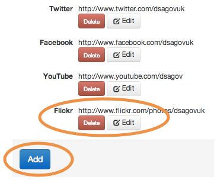	

* You have to add a Freedom of Information contact, which must be shown on your home page.
* Add other contacts (not for your home page) that appear frequently in your news and other documents - you will be able to pull these in from the list you create here.

### Add social media accounts

These can be added by selecting the menu item under the 'More' tab in your organisation hub. They will appear on your home page under the 'Follow us' heading.

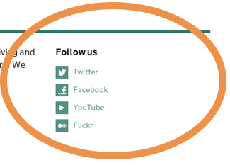   

Delete, edit and add new accounts as needed. Accounts are shown in the order you add them.

	

### Add people

See [guidance on how to add people and assign roles.](http://alphagov.github.io/inside-government-admin-guide/organisations-groups/people-and-roles.html) Once this is done you can go to the 'People' tab and drag people's names up and down to reorder them.

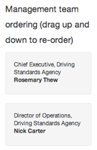   

### Add corporate information pages

You can add corporate information pages.

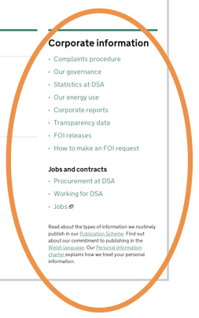	

* Click on the 'Corp info' tab.

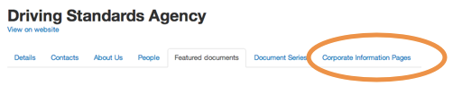	

* Delete or add new corporate info pages as needed.

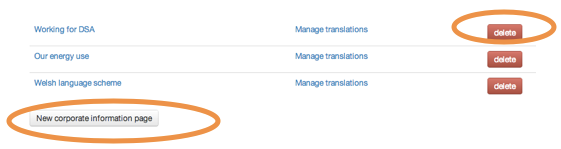	
	
* Pick a type (you can only use each type once), write your copy and save when you’re done.

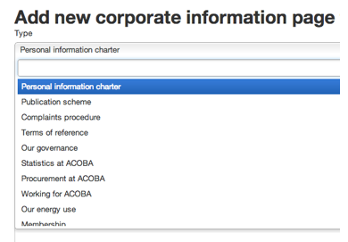	

The pages are designed specifically for the following information about your organisation and the [style guide: what we do](https://www.gov.uk/designprinciples/insidegovernment#what-we-do) contains guidance for each one:

* [Personal information charter](https://www.gov.uk/government/organisations/department-for-transport/about/personal-information-charter) for standards followed by orgs when asking for info (required)

* [Publication scheme](https://www.gov.uk/government/organisations/department-for-transport/about/publication-scheme) lists the information the org routinely makes available (required)

* [Complaints procedure](https://www.gov.uk/government/organisations/department-for-transport/about/complaints-procedure) (required)

* [Our governance](https://www.gov.uk/government/organisations/foreign-commonwealth-office/about/our-governance) describes the boards and committees that run the organisation

* [Statistics at x](https://www.gov.uk/government/organisations/department-for-transport/about/statistics) includes a forward look at releases and explains how the org compiles stats

* [Procurement](https://www.gov.uk/government/organisations/ministry-of-defence/about/procurement) offers information for potential suppliers

* [Working for x](https://www.gov.uk/government/organisations/ministry-of-defence/about/recruitment) provides direct links to job listings and any relevant recruitment or HR policies

* [Our energy use](https://www.gov.uk/government/organisations/hm-revenue-customs/about/our-energy-use) links to the org’s energy use data (generally central headquarters)

* [Welsh language scheme](https://www.gov.uk/government/organisations/wales-office/about/welsh-language-scheme) for orgs providing services in Wales

* Office access and opening times

