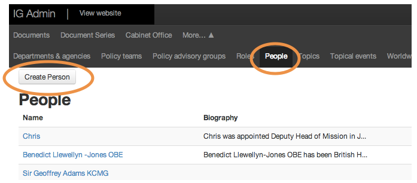
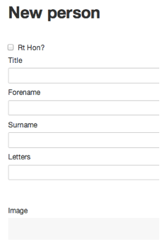
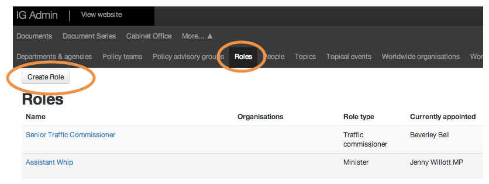
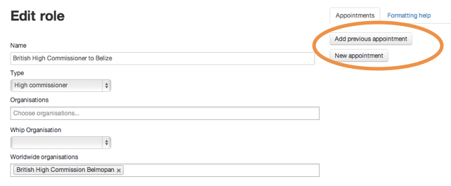

## People and roles

People and their roles are covered by 2 separate sections of the Publisher. You need the person first, then you can assign a role to them by editing the role.

You can reassign roles to new people, create new roles for people or just swap existing roles and people around.

### Add a person to GOV.UK

You can add new people when new ministerial appointments are made (check with GDS first). You can add new board members for your organisation (no permission needed) or add speakers for speeches.

* Click the 'People' tab to see a list of every person featured on GOV.UK.
* Click 'Create person' the to create a new person.

* Add a title, forename, surname and biography.
* Upload an image - it must be 960 x 640 px and minimum 75 dpi.
* Photos on a white background need a light tint overlay.

For structuring biographies, see the [style guide 6.1: biographies](https://www.gov.uk/designprinciples/insidegovernment#corporate-pages-biographies).

### Create and assign a role

You'll need to check with GDS before creating any ministerial roles. You can add new managerial roles or department roles.

* Click the 'Roles' tab to see a list of every role featured on GOV.UK.
* Click 'Create role' to create a new role.

* Write a description - remember this will appear alongside the person with this role so don't repeat content.
* Save the role; find it again from the list and re-open it for editing.
* Click 'New appointment' to assign the role to a new person.
* Enter a start date - the old role-holder will automatically end their tenure on this date.

[< Back to contents](http://alphagov.github.io/inside-government-admin-guide)
	
