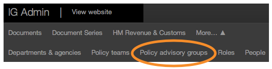
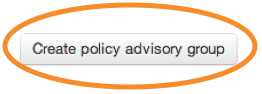
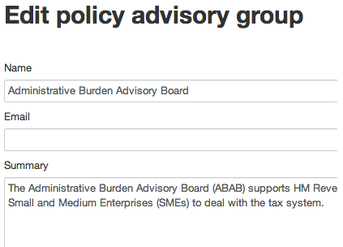
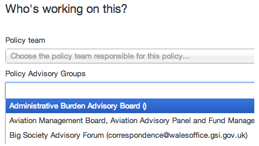
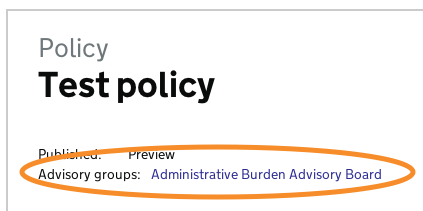

## Policy advisory group

Policy advisory groups are groups or commitees that have input to a policy eg the [HS2 Growth Taskforce](https://www.gov.uk/government/policy-advisory-groups/hs2-growth-taskforce). They are usually made up of external experts or stakeholders.

To create one, first click on ‘Policy advisory groups’.

	
Then click on ‘Create policy advisory group’.

Enter the name, email address, summary, description of the group and add any attachments.

Any changes made to these pages will go live as soon as you save them. So double check everything before you click ‘Save’.

Go to the policy page where you would like to add the group, then click ‘Edit’.

Scroll down to ‘Who’s working on this?’ and pick the group you want.
	
When you’re done click ‘Save’.

	
Preview the page and you’ll see there’s a link to the policy advisory group’s page.

## Teams

Teams are groups within organisations responsible for delivering an area of policy, eg the [HS2 team](https://www.gov.uk/government/policy-teams/high-speed-rail-team). The process of creating them is very similar to creating policy advisory teams. They also need to be associated with a policy. Do this by editing the policy page.