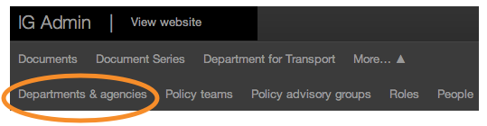
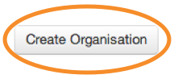
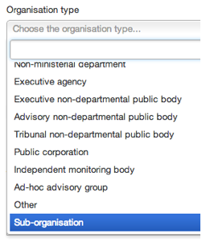

## Sub-organisation

1. Sub-orgs are high profile groups that have sufficient public profile and publishing activity to warrant an org-lite presence, nested beneath a parent body. 

	Please check with GDS before using this type.
	
	Any changes made to these pages will go live as soon as you save them. So double check everything before you click ‘Save’.
	
2. To create one, first click on ‘Departments & agencies’.

	
	
	Click on ‘Create organisation’.
	
	
	
3. Next change the organisation type to 'sub-organisation'.

	
	
4. Set the sponsoring department to your organisation.

		 
	
5. The sub-org appears at the bottom of your homepage under ‘High profile groups’.

		
	
	They have a organisation homepage like yours which accepts featured stories and more.
	
	

